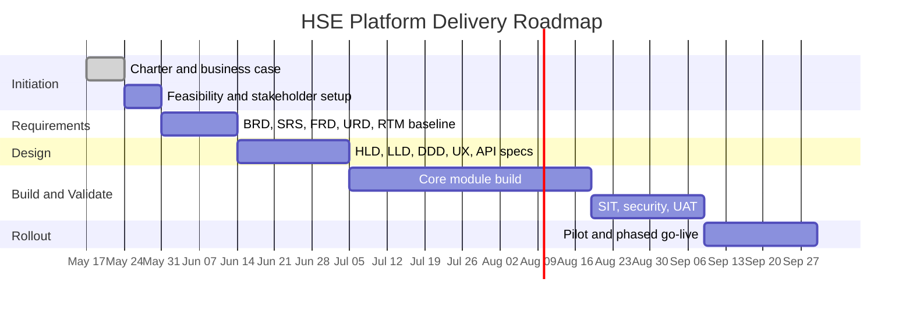

# Project Charter

*HSE Safety, Compliance & Intelligence Platform*

Generated on 2026-05-17 from source: HSE_Epics_UserStories_FreightFlexStyle.docx

## Document Control

Version: 1.0

Status: Draft for review

Owner: Project Manager / Product Owner

Source baseline: HSE epics and user stories in HSE_Epics_UserStories_FreightFlexStyle.docx

Review cycle: Business, HSE, IT, Security, Compliance, and Operations review before approval.

## Purpose

Authorise the initiation of the HSE Safety, Compliance & Intelligence Platform and define the mandate, scope, objectives, governance, and success criteria for delivery.

## Objectives

Digitise HSE, permit, audit, CAPA, incident, risk, vendor, asset, training, knowledge, and AI intelligence workflows.

Create a single governed platform with traceable records, mobile execution, analytics, and audit-ready evidence.

Improve compliance visibility, reduce manual administration, and support proactive risk prevention.

## In Scope

All 10 epics and 55 user stories from the source document.

Web and mobile user experience, workflow approvals, dashboards, exports, integrations, and security controls.

## Out of Scope

Physical IoT sensor deployment unless later approved.

Replacement of statutory regulator portals; the platform prepares and tracks regulatory notifications but does not guarantee regulator submission acceptance.

## Success Criteria

Core workflows adopted by target sites.

Audit trails complete for permits, audits, CAPA, vendor compliance, incidents, and training.

Dashboards provide near-real-time visibility for leadership and site teams.

Security and privacy controls pass pre-production assessment.

## Milestones

Initiation approval; requirements baseline; architecture and UX sign-off; build sprint completion; system integration testing; UAT; pilot go-live; enterprise rollout.

## Governance

Steering committee owns scope, budget, and priority decisions.

Product Owner owns backlog acceptance.

Project Manager owns schedule, risks, dependencies, and reporting.

HSE and Compliance owners approve regulatory and operational process fit.

## Visuals

### Project Timeline

