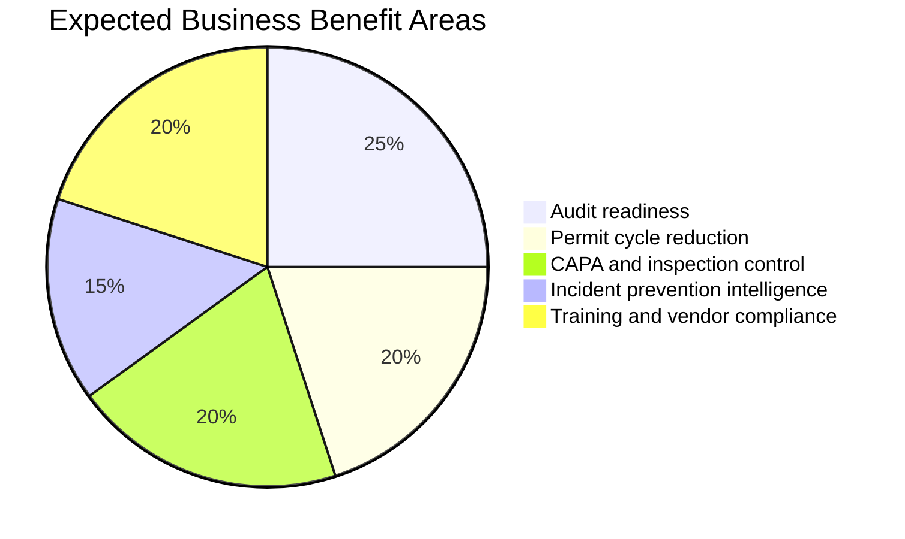

# Business Case

*HSE Safety, Compliance & Intelligence Platform*

Generated on 2026-05-17 from source: HSE_Epics_UserStories_FreightFlexStyle.docx

## Document Control

Version: 1.0

Status: Draft for review

Owner: Project Manager / Product Owner

Source baseline: HSE epics and user stories in HSE_Epics_UserStories_FreightFlexStyle.docx

Review cycle: Business, HSE, IT, Security, Compliance, and Operations review before approval.

## Problem Statement

Current HSE information is typically fragmented across spreadsheets, email approvals, local documents, and manual registers. This creates delayed visibility, weak traceability, duplicated effort, and higher compliance risk.

## Proposed Solution

Implement an integrated HSE platform that connects people, training, vendors, assets, audits, CAPA, risk, permits, incidents, knowledge, and AI-assisted intelligence.

## Expected Benefits

Reduced permit approval cycle time through mobile approvals and conflict detection.

Fewer overdue CAPAs, inspections, certifications, and vendor documents through automated alerts.

Improved audit readiness through immutable evidence trails and ISO clause mapping.

Better prevention through incident trends, predictive risk scores, and leading indicator detection.

## Cost Categories

Product design and engineering.

Cloud hosting, environments, observability, and backup.

Identity, notification, document storage, analytics, and AI services.

Testing, validation, training, migration, support, and change management.

## Risks

User adoption risk if mobile workflows are not simple enough.

Data quality risk during migration.

Integration risk with identity providers, HR systems, and notification providers.

AI governance risk if source attribution and review controls are weak.

## Recommendation

Proceed with phased delivery, starting with foundation, people/training, compliance/CAPA, risk, permit, and incident workflows before expanding AI intelligence across the full knowledge base.

## Visuals

### Benefit Distribution

