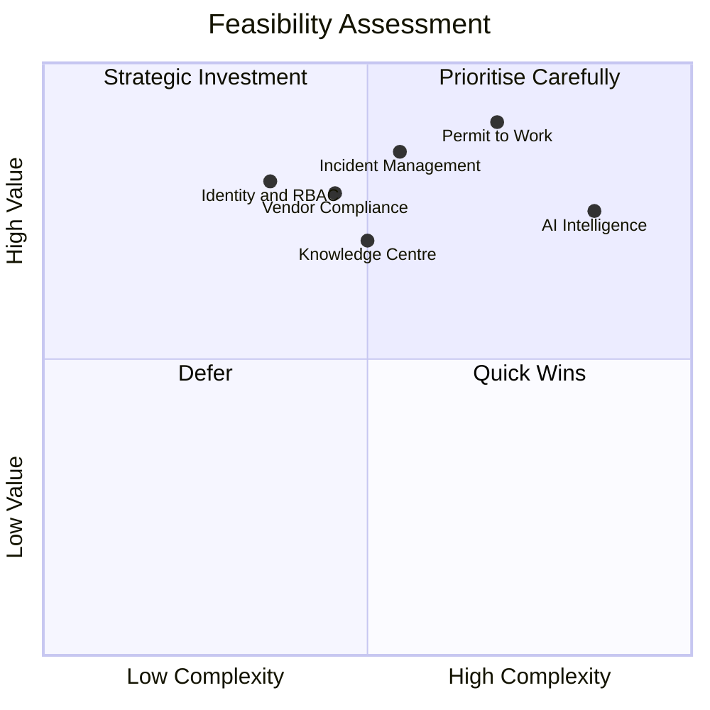

# Feasibility Study Report

*HSE Safety, Compliance & Intelligence Platform*

Generated on 2026-05-17 from source: HSE_Epics_UserStories_FreightFlexStyle.docx

## Document Control

Version: 1.0

Status: Draft for review

Owner: Project Manager / Product Owner

Source baseline: HSE epics and user stories in HSE_Epics_UserStories_FreightFlexStyle.docx

Review cycle: Business, HSE, IT, Security, Compliance, and Operations review before approval.

## Executive Summary

The project is feasible if delivered in phases with strong governance around master data, security, workflow configuration, and mobile usability.

## Technical Feasibility

A modern web and mobile architecture can support RBAC, workflow approvals, offline capture, document management, dashboards, and AI-assisted knowledge retrieval.

Critical technical dependencies include identity provider integration, object storage, notification services, analytics infrastructure, and secure AI retrieval.

## Operational Feasibility

Operational adoption is feasible because the platform maps to existing HSE roles: safety managers, auditors, plant managers, permit teams, HR, procurement, maintenance, gate security, and employees.

Business process harmonisation is required before configuration to avoid encoding inconsistent local practices.

## Economic Feasibility

The value case depends on reducing manual administration, audit preparation effort, compliance exposure, permit delays, incident recurrence, and unplanned downtime from overdue asset compliance.

## Legal and Compliance Feasibility

The solution must align with applicable HSE obligations, ISO 45001, ISO 14001, privacy rules, retention requirements, and internal audit policies.

Regulatory checklist ownership must remain with qualified compliance personnel.

## Conclusion

Proceed with a controlled MVP and pilot. Feasibility should be revalidated at architecture sign-off, security assessment, and UAT exit.

## Visuals

### Feasibility Scoring

