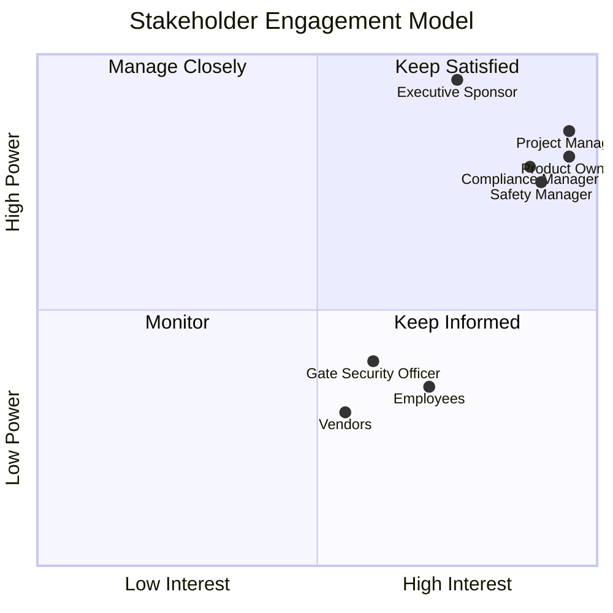

# Stakeholder Register

*HSE Safety, Compliance & Intelligence Platform*

Generated on 2026-05-17 from source: HSE_Epics_UserStories_FreightFlexStyle.docx

## Document Control

Version: 1.0

Status: Draft for review

Owner: Project Manager / Product Owner

Source baseline: HSE epics and user stories in HSE_Epics_UserStories_FreightFlexStyle.docx

Review cycle: Business, HSE, IT, Security, Compliance, and Operations review before approval.

## Stakeholder List

Executive Sponsor: interest in platform capability, workflow fit, data access, training, reporting, and operational adoption.

Project Manager: interest in platform capability, workflow fit, data access, training, reporting, and operational adoption.

Product Owner: interest in platform capability, workflow fit, data access, training, reporting, and operational adoption.

Safety Manager: interest in platform capability, workflow fit, data access, training, reporting, and operational adoption.

Compliance Manager: interest in platform capability, workflow fit, data access, training, reporting, and operational adoption.

Plant Manager: interest in platform capability, workflow fit, data access, training, reporting, and operational adoption.

IT Admin: interest in platform capability, workflow fit, data access, training, reporting, and operational adoption.

HR Admin: interest in platform capability, workflow fit, data access, training, reporting, and operational adoption.

Procurement Manager: interest in platform capability, workflow fit, data access, training, reporting, and operational adoption.

Maintenance Manager: interest in platform capability, workflow fit, data access, training, reporting, and operational adoption.

Permit Coordinator: interest in platform capability, workflow fit, data access, training, reporting, and operational adoption.

Safety Auditor: interest in platform capability, workflow fit, data access, training, reporting, and operational adoption.

CAPA Owner: interest in platform capability, workflow fit, data access, training, reporting, and operational adoption.

Document Controller: interest in platform capability, workflow fit, data access, training, reporting, and operational adoption.

Employee: interest in platform capability, workflow fit, data access, training, reporting, and operational adoption.

Vendor/Contractor: interest in platform capability, workflow fit, data access, training, reporting, and operational adoption.

Gate Security Officer: interest in platform capability, workflow fit, data access, training, reporting, and operational adoption.

Legal/HR Officer: interest in platform capability, workflow fit, data access, training, reporting, and operational adoption.

## Engagement Strategy

High-power/high-interest stakeholders receive steering committee reporting and decision workshops.

Operational users participate in workflow validation, prototype review, UAT, and training.

Security, Legal, and Compliance stakeholders approve controls before production.

## Communication Cadence

Weekly project working group.

Fortnightly steering committee.

Sprint demos at the end of each sprint.

Formal sign-offs at requirements baseline, design baseline, UAT exit, and go-live readiness.

## Visuals

### Stakeholder Power-Interest Grid

