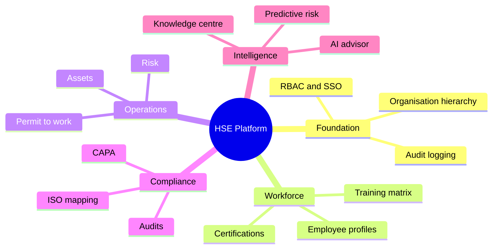

# Business Requirements Document (BRD)

*HSE Safety, Compliance & Intelligence Platform*

Generated on 2026-05-17 from source: HSE_Epics_UserStories_FreightFlexStyle.docx

## Document Control

Version: 1.0

Status: Draft for review

Owner: Project Manager / Product Owner

Source baseline: HSE epics and user stories in HSE_Epics_UserStories_FreightFlexStyle.docx

Review cycle: Business, HSE, IT, Security, Compliance, and Operations review before approval.

## Business Goals

Establish a single digital operating model for safety, compliance, and environmental health workflows.

Improve leadership visibility into leading and lagging safety indicators.

Enable audit-ready traceability for statutory, ISO, and internal compliance obligations.

## Functional Scope by Epic

### E1: Platform Foundation & Identity Management

Stories: 1.1-1.5

Included capability: Organisation hierarchy, authentication, RBAC, SSO, org chart.

### E2: People, Workforce & Training Intelligence

Stories: 2.1-2.5

Included capability: Employee profiles, certifications, shifts, training matrix, heatmaps.

### E3: Vendor & Contractor Compliance Lifecycle

Stories: 3.1-3.5

Included capability: Vendor onboarding, compliance standards, document expiry, QR gate checks.

### E4: Asset Management & Equipment Compliance

Stories: 4.1-4.5

Included capability: Asset register, inspection scheduling, permit asset linkage, dashboards.

### E5: Compliance Engine, Audit Checklists & CAPA

Stories: 5.1-5.6

Included capability: Checklist builder, mobile audits, non-conformance, CAPA, ISO mapping.

### E6: Risk Assessment & Hazard Management

Stories: 6.1-6.5

Included capability: Risk matrix, assessments, hazard observations, risk register, permit surfacing.

### E7: Permit to Work & Concurrent Work Management

Stories: 7.1-7.6

Included capability: Permit request, approval, conflict detection, live board, closure, audit trail.

### E8: Incident, Near Miss & Investigation Management

Stories: 8.1-8.6

Included capability: Incident reporting, classification, RCA, CAPA linkage, analytics, confidential records.

### E9: Knowledge Centre & Organisational Intelligence

Stories: 9.1-9.5

Included capability: Document control, search, SOP linkage, lessons learned, mobile SOP access.

### E10: AI Safety Advisor & Predictive Intelligence

Stories: 10.1-10.6

Included capability: AI advisor, predictive risk, audit insights, recommended controls, briefings.

## Core Requirements

- REQ-001: The platform shall support multi-tenant organisation hierarchy from Group to Company to Plant to Department.

- REQ-002: The platform shall enforce role-based and permission-based access across every module.

- REQ-003: The platform shall maintain immutable audit trails for approvals, changes, evidence, and exports.

- REQ-004: The platform shall support mobile-first workflows for audits, permits, incidents, SOP access, and contractor verification.

- REQ-005: The platform shall support configurable checklists, risk matrices, compliance standards, and workflow approvals.

- REQ-006: The platform shall generate alerts for expiring certifications, documents, inspections, overdue CAPAs, hazards, and permits.

- REQ-007: The platform shall link people, assets, vendors, SOPs, risk assessments, permits, incidents, audits, and CAPA records.

- REQ-008: The platform shall provide dashboards and exports suitable for operational, audit, and executive review.

- REQ-009: The platform shall protect confidential and personal data through access control, encryption, retention, and view logging.

- REQ-010: The platform shall use approved organisational knowledge as the source for AI responses and recommendations.

## Business Rules

Only approved vendors and qualified workers can be assigned to controlled work.

Expired certifications, documents, inspections, or non-compliant assets must block or escalate affected workflows.

Published compliance checklists and SOPs require versioning instead of direct overwrite.

High-risk permits require explicit acknowledgement and approval trail.

## Visuals

### Requirement Group Map

