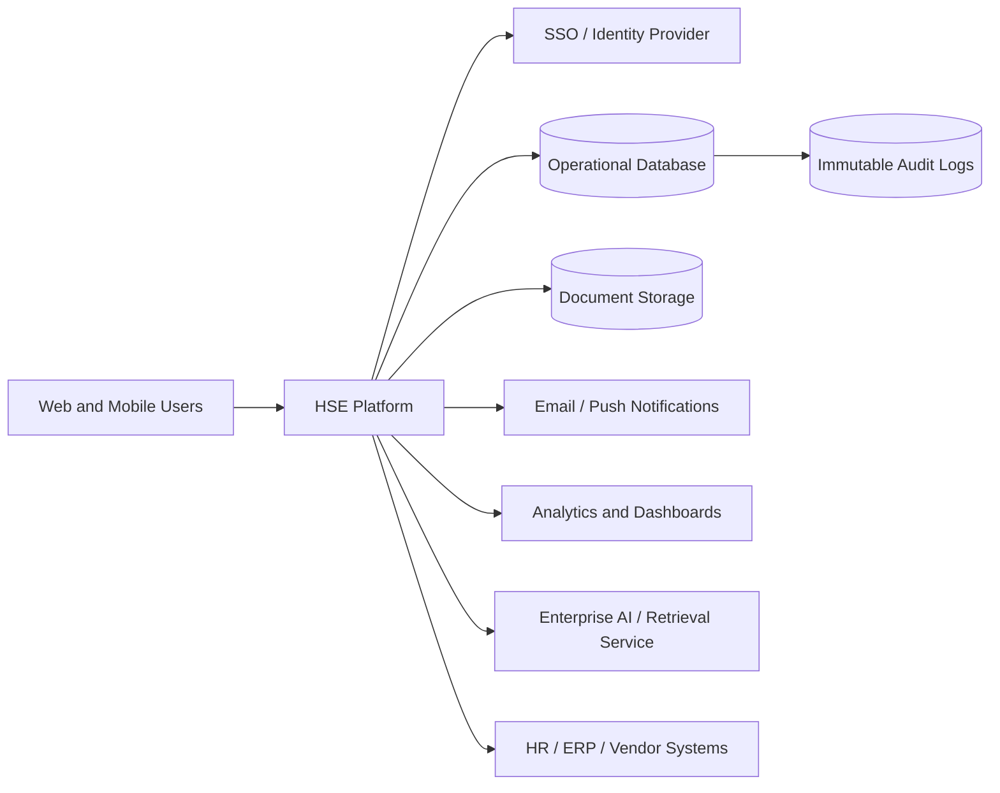

# Software Requirements Specification (SRS)

*HSE Safety, Compliance & Intelligence Platform*

Generated on 2026-05-17 from source: HSE_Epics_UserStories_FreightFlexStyle.docx

## Document Control

Version: 1.0

Status: Draft for review

Owner: Project Manager / Product Owner

Source baseline: HSE epics and user stories in HSE_Epics_UserStories_FreightFlexStyle.docx

Review cycle: Business, HSE, IT, Security, Compliance, and Operations review before approval.

## System Overview

The platform shall provide a secure, multi-tenant, configurable HSE application available through web and mobile channels.

## Core Requirements

- REQ-001: The platform shall support multi-tenant organisation hierarchy from Group to Company to Plant to Department.

- REQ-002: The platform shall enforce role-based and permission-based access across every module.

- REQ-003: The platform shall maintain immutable audit trails for approvals, changes, evidence, and exports.

- REQ-004: The platform shall support mobile-first workflows for audits, permits, incidents, SOP access, and contractor verification.

- REQ-005: The platform shall support configurable checklists, risk matrices, compliance standards, and workflow approvals.

- REQ-006: The platform shall generate alerts for expiring certifications, documents, inspections, overdue CAPAs, hazards, and permits.

- REQ-007: The platform shall link people, assets, vendors, SOPs, risk assessments, permits, incidents, audits, and CAPA records.

- REQ-008: The platform shall provide dashboards and exports suitable for operational, audit, and executive review.

- REQ-009: The platform shall protect confidential and personal data through access control, encryption, retention, and view logging.

- REQ-010: The platform shall use approved organisational knowledge as the source for AI responses and recommendations.

## Non-Functional Requirements

Availability target: define production SLA before contract baseline; recommended 99.5% or higher for core workflows.

Performance: common dashboard and search actions should complete within 2 seconds under agreed load.

Security: encryption in transit and at rest, least privilege access, MFA/SSO support, audit logging, and vulnerability remediation process.

Scalability: support phased rollout across multiple companies, plants, departments, and concurrent mobile users.

Reliability: offline capture for selected mobile workflows with conflict handling and sync status visibility.

## External Interfaces

Identity provider for SSO.

Email and push notification services.

Document/object storage.

HR/ERP/vendor master data systems where available.

AI service through approved enterprise AI platform with knowledge retrieval controls.

## Data Requirements

Maintain canonical records for users, roles, organisation nodes, vendors, assets, certifications, audits, CAPAs, risks, permits, incidents, documents, and AI interaction logs.

## Visuals

### System Context

