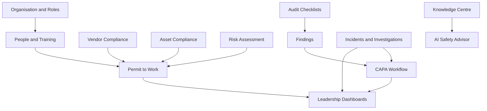

# Functional Requirements Document (FRD)

*HSE Safety, Compliance & Intelligence Platform*

Generated on 2026-05-17 from source: HSE_Epics_UserStories_FreightFlexStyle.docx

## Document Control

Version: 1.0

Status: Draft for review

Owner: Project Manager / Product Owner

Source baseline: HSE epics and user stories in HSE_Epics_UserStories_FreightFlexStyle.docx

Review cycle: Business, HSE, IT, Security, Compliance, and Operations review before approval.

## Functional Scope by Epic

### E1: Platform Foundation & Identity Management

Stories: 1.1-1.5

Included capability: Organisation hierarchy, authentication, RBAC, SSO, org chart.

### E2: People, Workforce & Training Intelligence

Stories: 2.1-2.5

Included capability: Employee profiles, certifications, shifts, training matrix, heatmaps.

### E3: Vendor & Contractor Compliance Lifecycle

Stories: 3.1-3.5

Included capability: Vendor onboarding, compliance standards, document expiry, QR gate checks.

### E4: Asset Management & Equipment Compliance

Stories: 4.1-4.5

Included capability: Asset register, inspection scheduling, permit asset linkage, dashboards.

### E5: Compliance Engine, Audit Checklists & CAPA

Stories: 5.1-5.6

Included capability: Checklist builder, mobile audits, non-conformance, CAPA, ISO mapping.

### E6: Risk Assessment & Hazard Management

Stories: 6.1-6.5

Included capability: Risk matrix, assessments, hazard observations, risk register, permit surfacing.

### E7: Permit to Work & Concurrent Work Management

Stories: 7.1-7.6

Included capability: Permit request, approval, conflict detection, live board, closure, audit trail.

### E8: Incident, Near Miss & Investigation Management

Stories: 8.1-8.6

Included capability: Incident reporting, classification, RCA, CAPA linkage, analytics, confidential records.

### E9: Knowledge Centre & Organisational Intelligence

Stories: 9.1-9.5

Included capability: Document control, search, SOP linkage, lessons learned, mobile SOP access.

### E10: AI Safety Advisor & Predictive Intelligence

Stories: 10.1-10.6

Included capability: AI advisor, predictive risk, audit insights, recommended controls, briefings.

## Workflow Requirements

Foundation workflows: organisation setup, invitation, role configuration, SSO, org chart.

Training workflows: employee profiles, certification expiry, shift scheduling, training gap escalation, compliance heatmap.

Vendor workflows: onboarding, standards validation, expiry alerts, mobile QR entry verification, history reporting.

Operational workflows: asset compliance, audits, CAPA, risk assessment, permit-to-work, incidents, investigations, SOP access.

AI workflows: knowledge-grounded chatbot, predictive risk scoring, audit insights, recommended controls, executive briefing, leading indicator detection.

## Reporting Requirements

PDF, Excel, and PowerPoint exports where specified in the user stories.

Dashboards for compliance scores, training, asset compliance, permits, incidents, risk register, vendor status, and AI safety intelligence.

## Configuration Requirements

Configurable organisation hierarchy, roles, permissions, vendor standards, asset compliance rules, audit checklists, ISO clauses, risk matrix, permit types, escalation rules, notification templates, and retention rules.

## Visuals

### Functional Workflow Map

