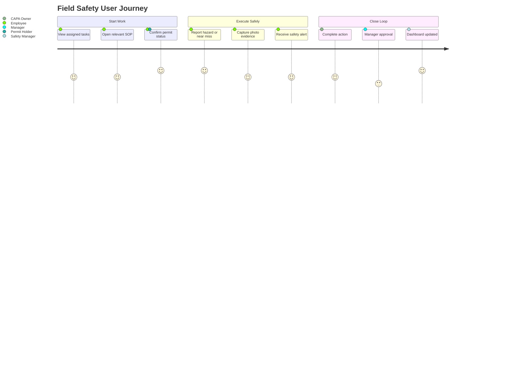
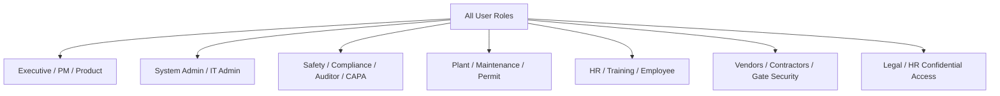

# User Requirement Document (URD)

*HSE Safety, Compliance & Intelligence Platform*

Generated on 2026-05-17 from source: HSE_Epics_UserStories_FreightFlexStyle.docx

## Document Control

Version: 1.0

Status: Draft for review

Owner: Project Manager / Product Owner

Source baseline: HSE epics and user stories in HSE_Epics_UserStories_FreightFlexStyle.docx

Review cycle: Business, HSE, IT, Security, Compliance, and Operations review before approval.

## User Groups

Executive Sponsor: requires role-appropriate access, clear task queues, dashboards, alerts, and export capability.

Project Manager: requires role-appropriate access, clear task queues, dashboards, alerts, and export capability.

Product Owner: requires role-appropriate access, clear task queues, dashboards, alerts, and export capability.

Safety Manager: requires role-appropriate access, clear task queues, dashboards, alerts, and export capability.

Compliance Manager: requires role-appropriate access, clear task queues, dashboards, alerts, and export capability.

Plant Manager: requires role-appropriate access, clear task queues, dashboards, alerts, and export capability.

IT Admin: requires role-appropriate access, clear task queues, dashboards, alerts, and export capability.

HR Admin: requires role-appropriate access, clear task queues, dashboards, alerts, and export capability.

Procurement Manager: requires role-appropriate access, clear task queues, dashboards, alerts, and export capability.

Maintenance Manager: requires role-appropriate access, clear task queues, dashboards, alerts, and export capability.

Permit Coordinator: requires role-appropriate access, clear task queues, dashboards, alerts, and export capability.

Safety Auditor: requires role-appropriate access, clear task queues, dashboards, alerts, and export capability.

CAPA Owner: requires role-appropriate access, clear task queues, dashboards, alerts, and export capability.

Document Controller: requires role-appropriate access, clear task queues, dashboards, alerts, and export capability.

Employee: requires role-appropriate access, clear task queues, dashboards, alerts, and export capability.

Vendor/Contractor: requires role-appropriate access, clear task queues, dashboards, alerts, and export capability.

Gate Security Officer: requires role-appropriate access, clear task queues, dashboards, alerts, and export capability.

Legal/HR Officer: requires role-appropriate access, clear task queues, dashboards, alerts, and export capability.

## User Needs

Employees need fast mobile reporting for incidents, near misses, hazards, and SOP access.

Managers need dashboards, escalations, approvals, and exception handling.

Auditors need immutable evidence, checklist execution, ISO clause mapping, and exportable reports.

Admins need configurable structures, roles, permissions, workflows, and master data controls.

## Usability Requirements

Mobile forms must be concise and usable in field conditions.

Critical status must use clear visual indicators and explanatory reasons.

Users must see assigned tasks, overdue work, and pending approvals without manual searching.

Offline-capable workflows must clearly show sync state.

## Visuals

### User Journey Overview

## Role Coverage and Access Summary

The platform covers the following role families:

- Executive and governance roles
- Platform and IT administration roles
- HSE, safety, compliance, audit, and CAPA roles
- Plant, maintenance, permit, and operational management roles
- HR, training, procurement, vendor, and contractor roles
- Employee self-service and field reporting roles
- Gate security and confidential incident review roles

Detailed access is maintained in [Application Screen, Role, Dashboard, Mobile, and Data Flow Inventory](../06_Application_Inventory/23_Application_Screen_Role_DataFlow_Inventory.md).

### Role Coverage Map

