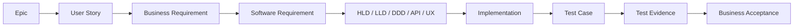

# Requirements Traceability Matrix (Initial Setup)

*HSE Safety, Compliance & Intelligence Platform*

Generated on 2026-05-17 from source: HSE_Epics_UserStories_FreightFlexStyle.docx

## Document Control

Version: 1.0

Status: Draft for review

Owner: Project Manager / Product Owner

Source baseline: HSE epics and user stories in HSE_Epics_UserStories_FreightFlexStyle.docx

Review cycle: Business, HSE, IT, Security, Compliance, and Operations review before approval.

## Traceability Approach

This initial RTM maps epics to requirement groups, design artifacts, test planning, and acceptance evidence. Story-level RTM should be expanded during sprint backlog refinement.

## E1 Trace

Epic: Platform Foundation & Identity Management

Story range: 1.1-1.5

Business requirement: BR-E1 deliver Organisation hierarchy, authentication, RBAC, SSO, org chart.

SRS reference: SRS-E1 module services, access control, data persistence, alerts, reports, and audit logging.

Design reference: HLD component and LLD module package for Platform Foundation & Identity Management.

Test reference: SIT/UAT scenarios covering acceptance criteria from the source stories.

Status: Draft baseline.

## E2 Trace

Epic: People, Workforce & Training Intelligence

Story range: 2.1-2.5

Business requirement: BR-E2 deliver Employee profiles, certifications, shifts, training matrix, heatmaps.

SRS reference: SRS-E2 module services, access control, data persistence, alerts, reports, and audit logging.

Design reference: HLD component and LLD module package for People, Workforce & Training Intelligence.

Test reference: SIT/UAT scenarios covering acceptance criteria from the source stories.

Status: Draft baseline.

## E3 Trace

Epic: Vendor & Contractor Compliance Lifecycle

Story range: 3.1-3.5

Business requirement: BR-E3 deliver Vendor onboarding, compliance standards, document expiry, QR gate checks.

SRS reference: SRS-E3 module services, access control, data persistence, alerts, reports, and audit logging.

Design reference: HLD component and LLD module package for Vendor & Contractor Compliance Lifecycle.

Test reference: SIT/UAT scenarios covering acceptance criteria from the source stories.

Status: Draft baseline.

## E4 Trace

Epic: Asset Management & Equipment Compliance

Story range: 4.1-4.5

Business requirement: BR-E4 deliver Asset register, inspection scheduling, permit asset linkage, dashboards.

SRS reference: SRS-E4 module services, access control, data persistence, alerts, reports, and audit logging.

Design reference: HLD component and LLD module package for Asset Management & Equipment Compliance.

Test reference: SIT/UAT scenarios covering acceptance criteria from the source stories.

Status: Draft baseline.

## E5 Trace

Epic: Compliance Engine, Audit Checklists & CAPA

Story range: 5.1-5.6

Business requirement: BR-E5 deliver Checklist builder, mobile audits, non-conformance, CAPA, ISO mapping.

SRS reference: SRS-E5 module services, access control, data persistence, alerts, reports, and audit logging.

Design reference: HLD component and LLD module package for Compliance Engine, Audit Checklists & CAPA.

Test reference: SIT/UAT scenarios covering acceptance criteria from the source stories.

Status: Draft baseline.

## E6 Trace

Epic: Risk Assessment & Hazard Management

Story range: 6.1-6.5

Business requirement: BR-E6 deliver Risk matrix, assessments, hazard observations, risk register, permit surfacing.

SRS reference: SRS-E6 module services, access control, data persistence, alerts, reports, and audit logging.

Design reference: HLD component and LLD module package for Risk Assessment & Hazard Management.

Test reference: SIT/UAT scenarios covering acceptance criteria from the source stories.

Status: Draft baseline.

## E7 Trace

Epic: Permit to Work & Concurrent Work Management

Story range: 7.1-7.6

Business requirement: BR-E7 deliver Permit request, approval, conflict detection, live board, closure, audit trail.

SRS reference: SRS-E7 module services, access control, data persistence, alerts, reports, and audit logging.

Design reference: HLD component and LLD module package for Permit to Work & Concurrent Work Management.

Test reference: SIT/UAT scenarios covering acceptance criteria from the source stories.

Status: Draft baseline.

## E8 Trace

Epic: Incident, Near Miss & Investigation Management

Story range: 8.1-8.6

Business requirement: BR-E8 deliver Incident reporting, classification, RCA, CAPA linkage, analytics, confidential records.

SRS reference: SRS-E8 module services, access control, data persistence, alerts, reports, and audit logging.

Design reference: HLD component and LLD module package for Incident, Near Miss & Investigation Management.

Test reference: SIT/UAT scenarios covering acceptance criteria from the source stories.

Status: Draft baseline.

## E9 Trace

Epic: Knowledge Centre & Organisational Intelligence

Story range: 9.1-9.5

Business requirement: BR-E9 deliver Document control, search, SOP linkage, lessons learned, mobile SOP access.

SRS reference: SRS-E9 module services, access control, data persistence, alerts, reports, and audit logging.

Design reference: HLD component and LLD module package for Knowledge Centre & Organisational Intelligence.

Test reference: SIT/UAT scenarios covering acceptance criteria from the source stories.

Status: Draft baseline.

## E10 Trace

Epic: AI Safety Advisor & Predictive Intelligence

Story range: 10.1-10.6

Business requirement: BR-E10 deliver AI advisor, predictive risk, audit insights, recommended controls, briefings.

SRS reference: SRS-E10 module services, access control, data persistence, alerts, reports, and audit logging.

Design reference: HLD component and LLD module package for AI Safety Advisor & Predictive Intelligence.

Test reference: SIT/UAT scenarios covering acceptance criteria from the source stories.

Status: Draft baseline.

## Visuals

### Traceability Flow

