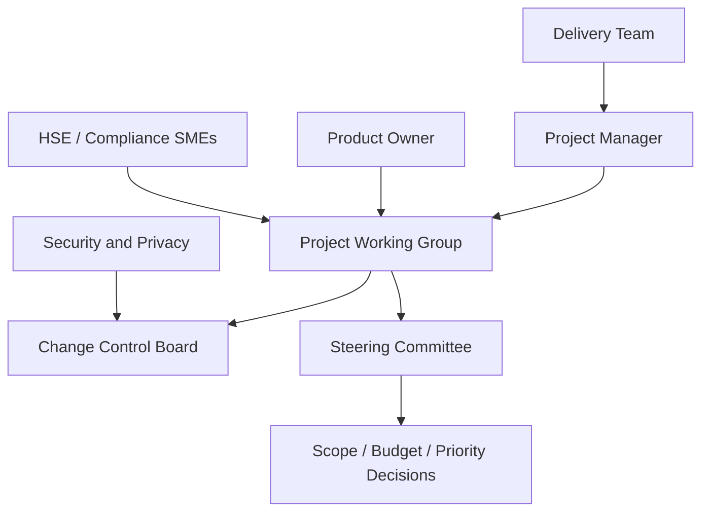

# Project Management Plan

*HSE Safety, Compliance & Intelligence Platform*

Generated on 2026-05-17 from source: HSE_Epics_UserStories_FreightFlexStyle.docx

## Document Control

Version: 1.0

Status: Draft for review

Owner: Project Manager / Product Owner

Source baseline: HSE epics and user stories in HSE_Epics_UserStories_FreightFlexStyle.docx

Review cycle: Business, HSE, IT, Security, Compliance, and Operations review before approval.

## Delivery Approach

Use phased agile delivery with formal stage gates for requirements, design, security, UAT, and go-live readiness.

Maintain a prioritised backlog mapped to the RTM and source epics.

## Governance

Steering committee resolves scope, budget, priority, and risk escalations.

Change control board reviews material scope, cost, timeline, compliance, or security changes.

## Schedule Management

Plan discovery, design, build, testing, pilot, and rollout waves.

Track milestones, sprint burndown, dependencies, and release readiness.

## Quality Management

Definition of Done includes code review, unit coverage where applicable, security checks, audit logging, acceptance criteria validation, and product owner acceptance.

## Change Management

Training, SOP updates, role-based enablement, UAT champions, go-live support, and feedback loops are required for adoption.

## Visuals

### Governance Flow

