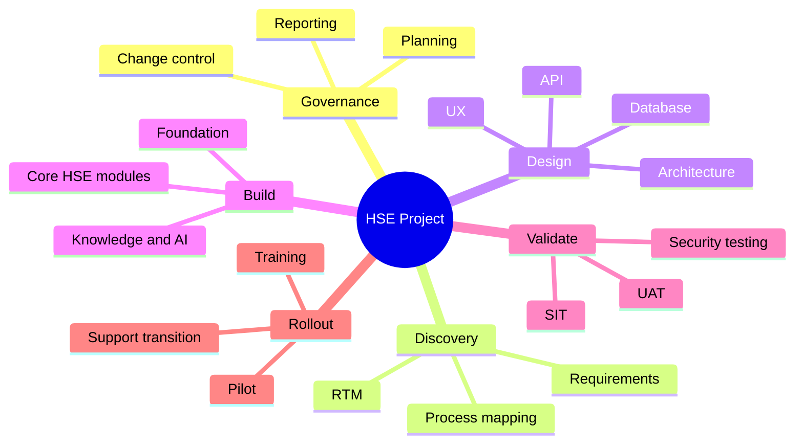

# Work Breakdown Structure (WBS)

*HSE Safety, Compliance & Intelligence Platform*

Generated on 2026-05-17 from source: HSE_Epics_UserStories_FreightFlexStyle.docx

## Document Control

Version: 1.0

Status: Draft for review

Owner: Project Manager / Product Owner

Source baseline: HSE epics and user stories in HSE_Epics_UserStories_FreightFlexStyle.docx

Review cycle: Business, HSE, IT, Security, Compliance, and Operations review before approval.

## Level 1 Work Packages

- 1. Project governance and management.

- 2. Requirements and process discovery.

- 3. Solution architecture and UX design.

- 4. Platform foundation.

- 5. Core HSE modules.

- 6. Knowledge and AI modules.

- 7. Integrations and migration.

- 8. Testing and validation.

- 9. Training and rollout.

- 10. Support transition.

## Module Work Packages

- E1: Analyse, design, build, test, document, train, and deploy Platform Foundation & Identity Management.

- E2: Analyse, design, build, test, document, train, and deploy People, Workforce & Training Intelligence.

- E3: Analyse, design, build, test, document, train, and deploy Vendor & Contractor Compliance Lifecycle.

- E4: Analyse, design, build, test, document, train, and deploy Asset Management & Equipment Compliance.

- E5: Analyse, design, build, test, document, train, and deploy Compliance Engine, Audit Checklists & CAPA.

- E6: Analyse, design, build, test, document, train, and deploy Risk Assessment & Hazard Management.

- E7: Analyse, design, build, test, document, train, and deploy Permit to Work & Concurrent Work Management.

- E8: Analyse, design, build, test, document, train, and deploy Incident, Near Miss & Investigation Management.

- E9: Analyse, design, build, test, document, train, and deploy Knowledge Centre & Organisational Intelligence.

- E10: Analyse, design, build, test, document, train, and deploy AI Safety Advisor & Predictive Intelligence.

## Deliverables

Approved requirements baseline.

Approved design baseline.

Configured environments.

Working software increments.

Test evidence.

Training material.

Go-live readiness pack.

Post-implementation support handover.

## Visuals

### WBS Tree

