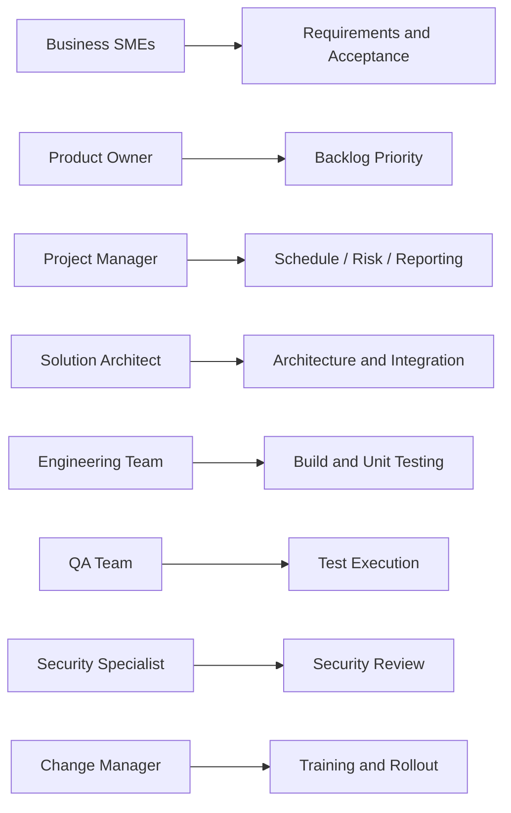

# Resource Management Plan

*HSE Safety, Compliance & Intelligence Platform*

Generated on 2026-05-17 from source: HSE_Epics_UserStories_FreightFlexStyle.docx

## Document Control

Version: 1.0

Status: Draft for review

Owner: Project Manager / Product Owner

Source baseline: HSE epics and user stories in HSE_Epics_UserStories_FreightFlexStyle.docx

Review cycle: Business, HSE, IT, Security, Compliance, and Operations review before approval.

## Project Roles

Project Manager, Product Owner, Business Analyst, Solution Architect, UX Designer, Frontend Engineer, Backend Engineer, Mobile Engineer, QA Engineer, DevOps Engineer, Security Specialist, Data/AI Engineer, Change Manager, Support Lead.

## Business Roles

HSE process owners, site champions, audit/compliance SMEs, HR/training SMEs, procurement/vendor SMEs, maintenance SMEs, permit-to-work SMEs, incident investigation SMEs.

## Responsibility Principles

Business SMEs own process decisions and acceptance.

Engineering owns technical implementation and maintainability.

Security and Compliance own control validation.

Operations owns readiness for rollout and support.

## Capacity Management

Maintain sprint capacity plan.

Protect SME time for workshops, reviews, UAT, and sign-offs.

Track critical resource constraints and escalate early.

## Visuals

### Responsibility Overview

