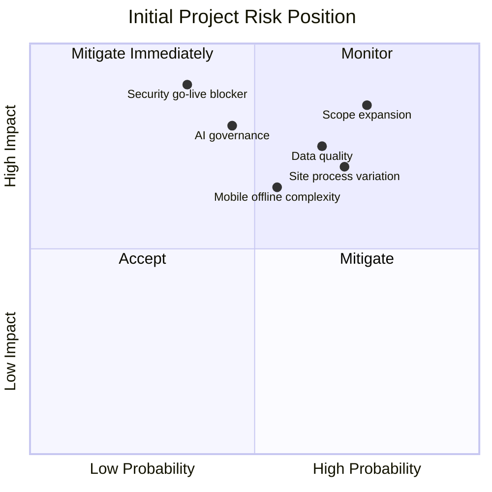

# Risk Management Plan

*HSE Safety, Compliance & Intelligence Platform*

Generated on 2026-05-17 from source: HSE_Epics_UserStories_FreightFlexStyle.docx

## Document Control

Version: 1.0

Status: Draft for review

Owner: Project Manager / Product Owner

Source baseline: HSE epics and user stories in HSE_Epics_UserStories_FreightFlexStyle.docx

Review cycle: Business, HSE, IT, Security, Compliance, and Operations review before approval.

## Risk Method

Maintain a project risk register with probability, impact, owner, mitigation, contingency, due date, and status.

Review risks weekly and escalate high residual risks to the steering committee.

## Initial Project Risks

- R-001: Scope expansion across many HSE domains may delay MVP; mitigate through phased releases.

- R-002: Inconsistent site processes may create configuration complexity; mitigate through standard process workshops.

- R-003: Weak source data quality may affect dashboards and AI; mitigate through data profiling and migration controls.

- R-004: Mobile offline complexity may affect field adoption; mitigate through early prototypes and pilot testing.

- R-005: AI recommendations may be over-trusted; mitigate through source citation, disclaimers, review controls, and logging.

- R-006: Security/privacy gaps may block go-live; mitigate through early security assessment and threat modelling.

## Escalation Thresholds

High impact on safety, compliance, privacy, schedule, budget, or production readiness requires steering committee escalation.

## Visuals

### Project Risk Matrix

