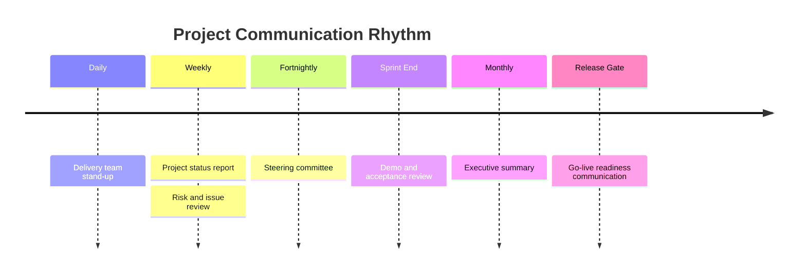

# Communication Plan

*HSE Safety, Compliance & Intelligence Platform*

Generated on 2026-05-17 from source: HSE_Epics_UserStories_FreightFlexStyle.docx

## Document Control

Version: 1.0

Status: Draft for review

Owner: Project Manager / Product Owner

Source baseline: HSE epics and user stories in HSE_Epics_UserStories_FreightFlexStyle.docx

Review cycle: Business, HSE, IT, Security, Compliance, and Operations review before approval.

## Communication Objectives

Keep stakeholders aligned on scope, schedule, risks, decisions, dependencies, and readiness.

Create fast feedback loops with operational users.

## Cadence

Daily delivery team coordination during active build.

Weekly project status report.

Fortnightly steering committee.

Sprint review/demo.

Monthly executive summary.

Release readiness communications before pilot and rollout.

## Channels

Project workspace for documents and decisions.

Issue tracker for backlog, defects, and risks.

Email for formal approvals and executive updates.

Workshops for process and design decisions.

Training sessions for user enablement.

## Reporting Content

Status, achievements, next milestones, risks, issues, decisions needed, budget/schedule indicators, quality indicators, and change impacts.

## Visuals

### Communication Cadence

