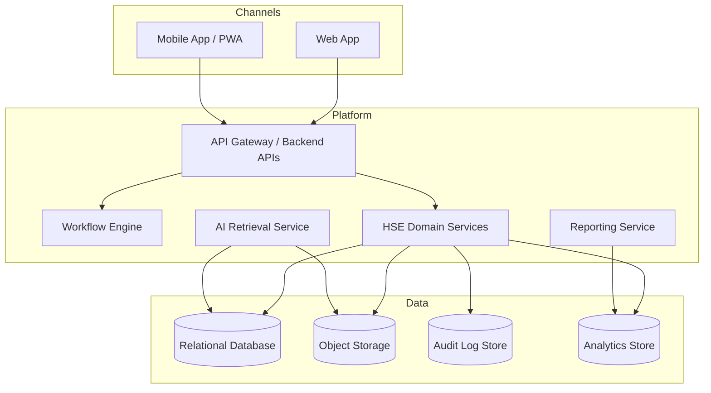
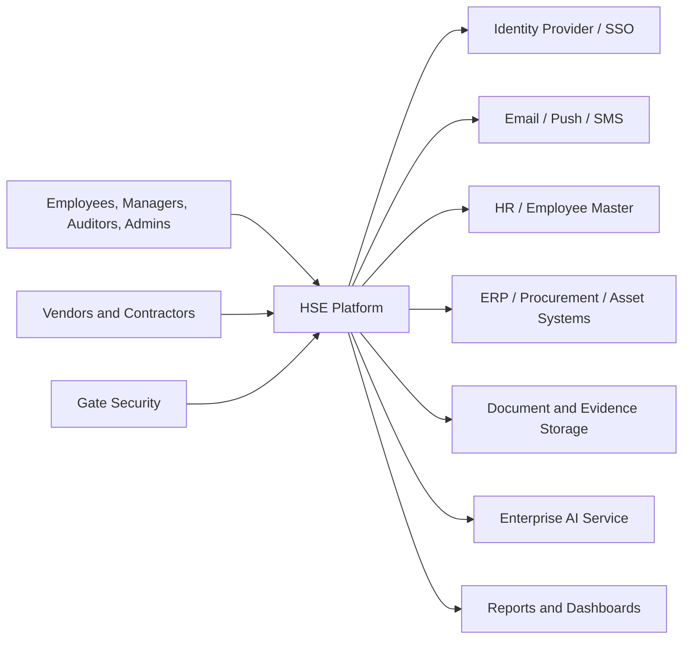
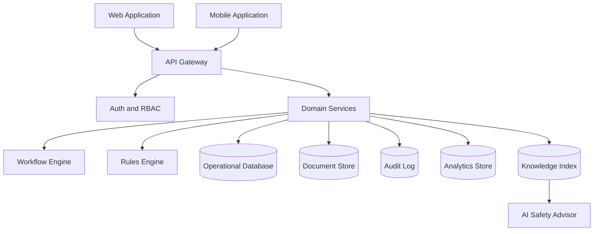

# High-Level Design (HLD)

*HSE Safety, Compliance & Intelligence Platform*

Generated on 2026-05-17 from source: HSE_Epics_UserStories_FreightFlexStyle.docx

## Document Control

Version: 1.0

Status: Draft for review

Owner: Project Manager / Product Owner

Source baseline: HSE epics and user stories in HSE_Epics_UserStories_FreightFlexStyle.docx

Review cycle: Business, HSE, IT, Security, Compliance, and Operations review before approval.

## Architecture Overview

Recommended architecture: responsive web application, mobile application or PWA for field workflows, API layer, workflow engine, relational operational database, object/document storage, analytics layer, notification service, identity integration, and AI retrieval service.

## Major Components

Identity and access management.

Organisation and master data services.

Workflow and approval engine.

Module services for training, vendors, assets, compliance, risk, permits, incidents, knowledge, and AI.

Reporting and analytics.

Audit logging and export service.

Integration layer.

## Data Flow

Users authenticate through SSO or local credentials.

Module actions pass through API authorization and validation.

Workflow events create notifications and audit entries.

Operational data feeds dashboards and AI retrieval where approved.

Exports are generated from immutable records.

## Deployment View

Separate development, test, staging, and production environments.

Automated CI/CD with controlled approvals for production.

Centralised logging, monitoring, backup, and disaster recovery procedures.

## Visuals

### High-Level Architecture

## Expanded Data Flow Diagrams

The complete screen, role, dashboard, mobile, and data flow inventory is maintained in [Application Screen, Role, Dashboard, Mobile, and Data Flow Inventory](../06_Application_Inventory/23_Application_Screen_Role_DataFlow_Inventory.md).

### Level 0 Context DFD

### Level 1 Platform DFD

