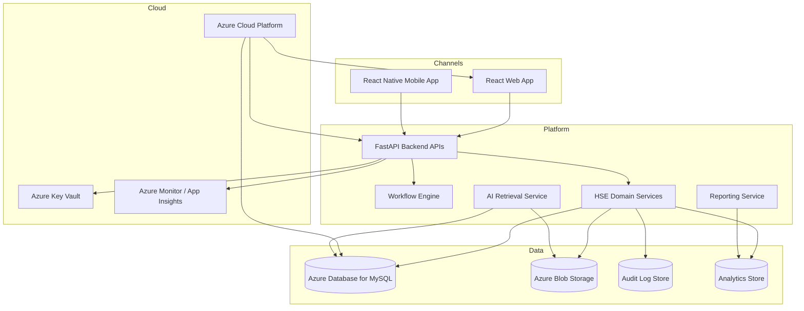
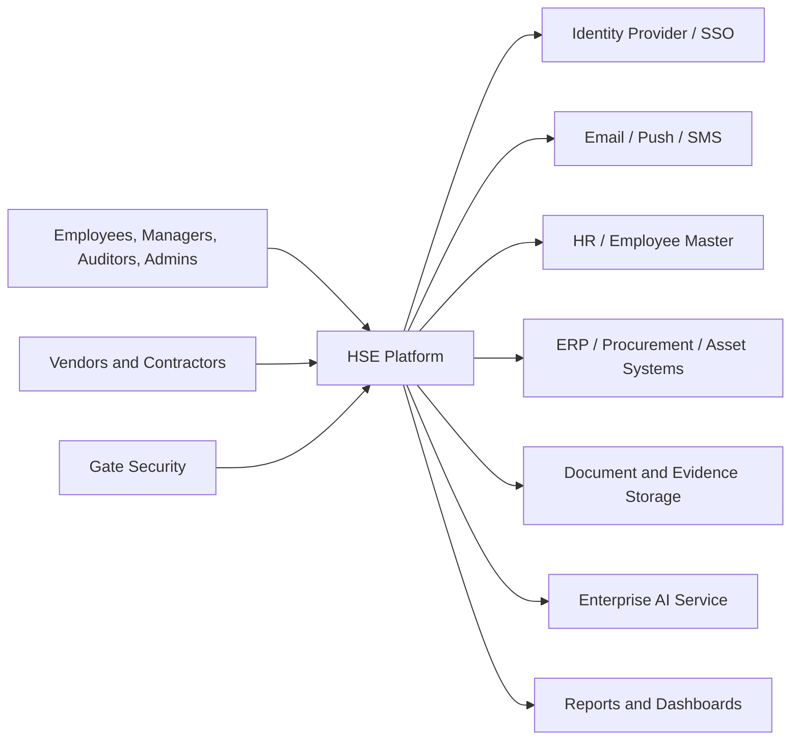
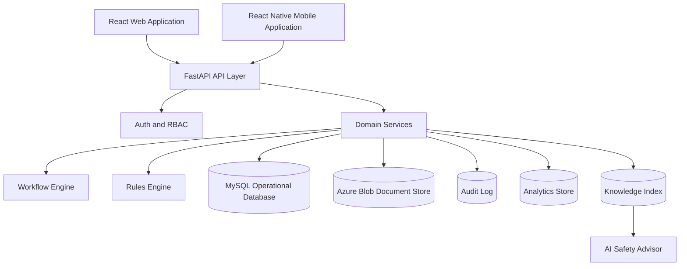

# High-Level Design (HLD)

*HSE Safety, Compliance & Intelligence Platform*

Generated on 2026-05-17 from source: HSE_Epics_UserStories_FreightFlexStyle.docx

## Document Control

Version: 1.0

Status: Draft for review

Owner: Project Manager / Product Owner

Source baseline: HSE epics and user stories in HSE_Epics_UserStories_FreightFlexStyle.docx

Review cycle: Business, HSE, IT, Security, Compliance, and Operations review before approval.

## Architecture Overview

Recommended architecture: responsive web application, mobile application or PWA for field workflows, API layer, workflow engine, relational operational database, object/document storage, analytics layer, notification service, identity integration, and AI retrieval service.

## Technology Stack

| Layer | Selected Technology | Purpose |
|---|---|---|
| Web frontend | React | Browser-based dashboards, admin screens, workflow pages, reports, and operational views |
| Mobile app | React Native | Field workflows for permits, audits, incidents, hazards, QR scan, SOP access, evidence capture, and offline sync |
| Backend API | FastAPI | REST API layer, validation, workflow orchestration, integrations, reporting endpoints, and AI service endpoints |
| Operational database | MySQL | Tenant-scoped transactional data for users, roles, assets, vendors, permits, incidents, audits, CAPA, risk, and training |
| Cloud platform | Azure | Hosting, networking, storage, identity integration, monitoring, secrets, backups, and deployment environments |

## Azure Deployment Components

| Component | Recommended Azure Service |
|---|---|
| React web app hosting | Azure Static Web Apps or Azure App Service |
| React Native backend access | FastAPI endpoints exposed through Azure-hosted API layer |
| FastAPI runtime | Azure App Service, Azure Container Apps, or Azure Kubernetes Service depending on scale |
| MySQL database | Azure Database for MySQL Flexible Server |
| File and evidence storage | Azure Blob Storage |
| Secrets | Azure Key Vault |
| Monitoring and logs | Azure Monitor and Application Insights |
| CI/CD | GitHub Actions or Azure DevOps Pipelines |
| Identity integration | Azure Entra ID / external OIDC or SAML provider |

## Major Components

Identity and access management.

Organisation and master data services.

Workflow and approval engine.

Module services for training, vendors, assets, compliance, risk, permits, incidents, knowledge, and AI.

Reporting and analytics.

Audit logging and export service.

Integration layer.

## Data Flow

Users authenticate through SSO or local credentials.

Module actions pass through API authorization and validation.

Workflow events create notifications and audit entries.

Operational data feeds dashboards and AI retrieval where approved.

Exports are generated from immutable records.

## Deployment View

Separate development, test, staging, and production environments.

Automated CI/CD with controlled approvals for production.

Centralised logging, monitoring, backup, and disaster recovery procedures.

## Visuals

### High-Level Architecture

## Expanded Data Flow Diagrams

The complete screen, role, dashboard, mobile, and data flow inventory is maintained in [Application Screen, Role, Dashboard, Mobile, and Data Flow Inventory](../06_Application_Inventory/23_Application_Screen_Role_DataFlow_Inventory.md).

### Level 0 Context DFD

### Level 1 Platform DFD

