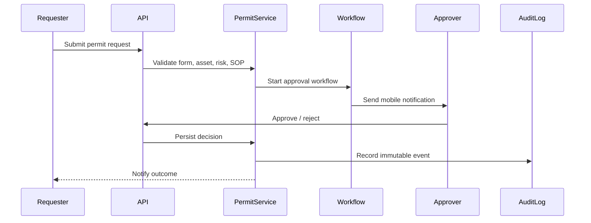

# Low-Level Design (LLD)

*HSE Safety, Compliance & Intelligence Platform*

Generated on 2026-05-17 from source: HSE_Epics_UserStories_FreightFlexStyle.docx

## Document Control

Version: 1.0

Status: Draft for review

Owner: Project Manager / Product Owner

Source baseline: HSE epics and user stories in HSE_Epics_UserStories_FreightFlexStyle.docx

Review cycle: Business, HSE, IT, Security, Compliance, and Operations review before approval.

## Module Design Pattern

Each module should expose API controllers, service layer, validation rules, repository/data access, workflow hooks, notification hooks, audit logging, and export/report handlers.

## Key Services

AuthService, OrganisationService, PermissionService, EmployeeService, TrainingService, VendorService, AssetService, ComplianceService, AuditService, CapaService, RiskService, PermitService, IncidentService, KnowledgeService, AiAdvisorService, NotificationService, ReportService, AuditLogService.

## Workflow State Examples

CAPA: Open, In Progress, Pending Approval, Closed.

Permit: Draft, Submitted, Under Review, Approved, Active, Extended, Closed, Expired, Rejected.

Vendor: Draft, Pending Approval, Approved, Expiring, Suspended, Rejected.

Incident: Reported, Classified, Investigation Open, CAPA Open, Closed.

## Validation Examples

Block task assignment when required certification is expired.

Block permit submission if mandatory safety controls are missing.

Require senior approval and justification for concurrent permit overrides.

Require evidence before CAPA closure submission.

Restrict confidential incident access to authorised roles.

## Visuals

### Permit Approval Sequence

