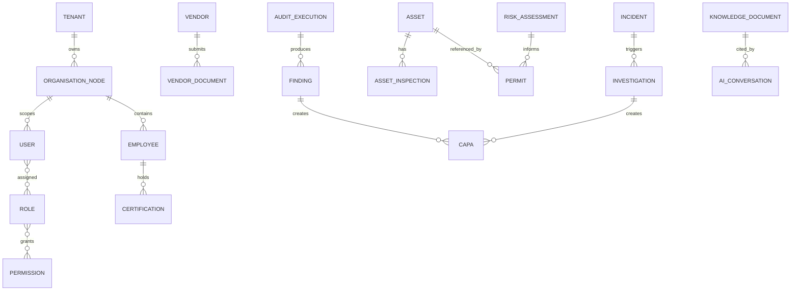

# Database Design Document (DDD)

*HSE Safety, Compliance & Intelligence Platform*

Generated on 2026-05-17 from source: HSE_Epics_UserStories_FreightFlexStyle.docx

## Document Control

Version: 1.0

Status: Draft for review

Owner: Project Manager / Product Owner

Source baseline: HSE epics and user stories in HSE_Epics_UserStories_FreightFlexStyle.docx

Review cycle: Business, HSE, IT, Security, Compliance, and Operations review before approval.

## Data Model Overview

The database should use tenant-scoped entities with audit fields, soft-delete policy where appropriate, and immutable event/audit tables for regulated records.

## Core Entities

Tenant, OrganisationNode, User, Role, Permission, Employee, Certification, Shift, TrainingRequirement, TrainingCompletion, Vendor, VendorDocument, Asset, AssetInspection, ComplianceChecklist, ChecklistQuestion, AuditExecution, Finding, CAPA, RiskAssessment, HazardObservation, Permit, PermitApproval, Incident, Investigation, KnowledgeDocument, AiConversation, Notification, AuditLog.

## Relationships

OrganisationNode scopes users, employees, vendors, assets, audits, permits, incidents, and dashboards.

ChecklistQuestion maps to ISO clauses and linked SOPs.

Audit findings create CAPA records.

Risk assessments and assets link to permits.

Incident investigations create CAPA records and lessons learned.

Knowledge documents provide source material for AI responses.

## Data Controls

Use unique business references for permits, incidents, assets, audits, CAPAs, and vendors.

Store documents in object storage with database metadata and integrity references.

Use immutable append-only audit events for regulated workflows.

Apply retention and legal hold rules to confidential and compliance records.

## Visuals

### Core Entity Relationship View

