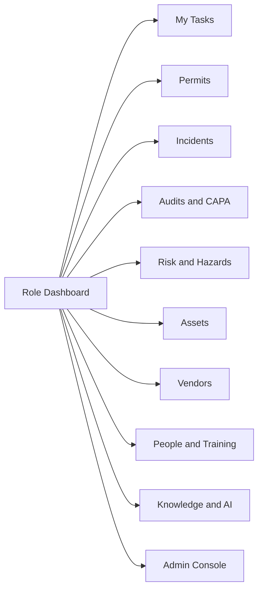
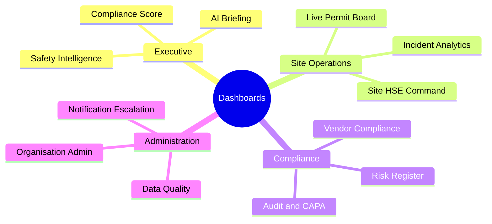
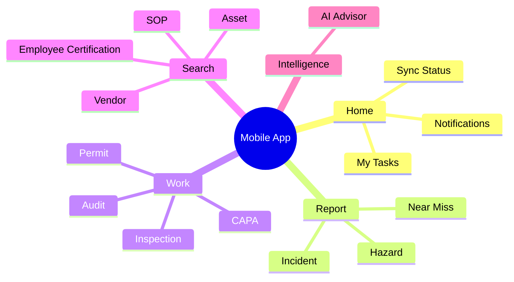

# UI/UX Design Specs

*HSE Safety, Compliance & Intelligence Platform*

Generated on 2026-05-17 from source: HSE_Epics_UserStories_FreightFlexStyle.docx

## Document Control

Version: 1.0

Status: Draft for review

Owner: Project Manager / Product Owner

Source baseline: HSE epics and user stories in HSE_Epics_UserStories_FreightFlexStyle.docx

Review cycle: Business, HSE, IT, Security, Compliance, and Operations review before approval.

## Design Principles

Prioritise operational speed, scanability, clear status, and low-friction field capture.

Use role-based dashboards and task queues as entry points.

Mobile screens should minimise typing and support camera, QR, GPS, and offline usage.

## Primary Views

Admin console for organisation, roles, permissions, configuration.

People and training dashboard.

Vendor compliance workspace.

Asset compliance dashboard.

Audit and CAPA workspace.

Risk register and assessment builder.

Permit request, approval, and live board.

Incident reporting and investigation workspace.

Knowledge centre and AI advisor.

Executive intelligence dashboard.

## Interaction Requirements

Use filters, drill-downs, status chips, clear blocking reasons, and contextual actions.

Approvals must show key decision information without opening multiple screens.

Evidence capture must support photos, files, notes, timestamps, and user attribution.

Exports should be available from relevant dashboard and record detail pages.

## Accessibility

Support keyboard navigation, sufficient colour contrast, labels for controls, readable mobile layouts, and non-colour status text.

## Visuals

### Primary Navigation Model

## Page and Screen Inventory

The application is expected to contain:

- Web dashboard pages: 17
- Web operational/admin pages: 66
- Mobile screens: 31
- Primary roles covered: 20 role entries, including combined Employee / Contractor and Legal / HR Officer

Refer to [Application Screen, Role, Dashboard, Mobile, and Data Flow Inventory](../06_Application_Inventory/23_Application_Screen_Role_DataFlow_Inventory.md) for the full dashboard list, detailed page inventory, mobile screen inventory, and role access matrix.

### Dashboard Families

### Mobile Screen Groups

