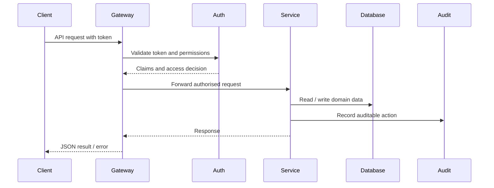

# API Specification Document

*HSE Safety, Compliance & Intelligence Platform*

Generated on 2026-05-17 from source: HSE_Epics_UserStories_FreightFlexStyle.docx

## Document Control

Version: 1.0

Status: Draft for review

Owner: Project Manager / Product Owner

Source baseline: HSE epics and user stories in HSE_Epics_UserStories_FreightFlexStyle.docx

Review cycle: Business, HSE, IT, Security, Compliance, and Operations review before approval.

## API Style

Use REST or a documented equivalent API style with JSON payloads, versioned endpoints, standard error format, pagination, filtering, sorting, idempotency where needed, and correlation IDs.

## Endpoint Groups

/auth, /organisations, /users, /roles, /employees, /training, /vendors, /assets, /compliance, /audits, /capa, /risks, /hazards, /permits, /incidents, /investigations, /knowledge, /ai, /notifications, /reports, /audit-logs.

## Security

OAuth2/OIDC bearer tokens or approved enterprise equivalent.

Endpoint-level authorization checks against tenant, role, permission, and record sensitivity.

Rate limiting and request validation on public or mobile endpoints.

Audit log for all create, update, approve, reject, export, and confidential view actions.

## Example Operations

POST /permits creates a permit request and starts workflow.

POST /permits/{id}/approve records approval decision.

POST /incidents submits an incident or near miss.

POST /audits/{id}/findings creates finding and may generate CAPA.

GET /knowledge/search returns governed SOP and policy results.

POST /ai/advisor/query returns source-cited answer from approved knowledge.

## Visuals

### API Request Pattern

