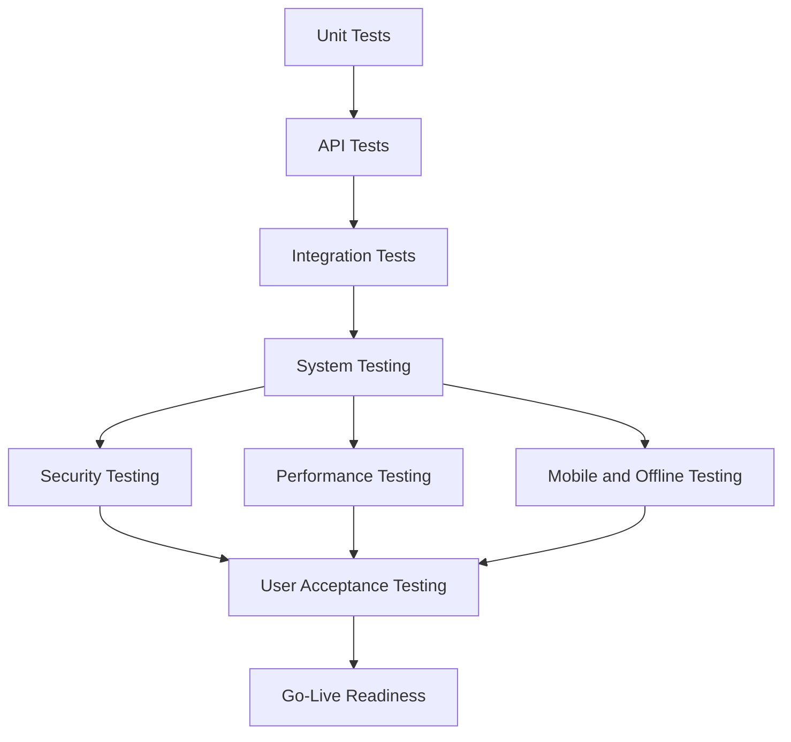

# Test Plan

*HSE Safety, Compliance & Intelligence Platform*

Generated on 2026-05-17 from source: HSE_Epics_UserStories_FreightFlexStyle.docx

## Document Control

Version: 1.0

Status: Draft for review

Owner: Project Manager / Product Owner

Source baseline: HSE epics and user stories in HSE_Epics_UserStories_FreightFlexStyle.docx

Review cycle: Business, HSE, IT, Security, Compliance, and Operations review before approval.

## Test Strategy

Validate the platform through unit testing, API testing, integration testing, system testing, security testing, performance testing, mobile/offline testing, UAT, and regression testing.

## Scope

All 10 epics, role access, workflow state transitions, notifications, evidence capture, dashboards, exports, audit logs, configuration, integrations, and AI source citation.

## Entry Criteria

Approved requirements and design baseline.

Test environment available.

Seed data prepared.

Test cases mapped to RTM.

Build deployed with release notes.

## Exit Criteria

No open critical or high defects.

Accepted UAT scenarios for MVP scope.

Security findings remediated or formally risk-accepted.

Performance and backup checks completed.

Go-live readiness approved.

## Sample Test Areas

RBAC and 403 route behavior.

Certification expiry blocks assignment.

Vendor QR status works offline from cache.

Audit non-conformance creates CAPA.

Permit conflict requires senior override.

Confidential incident view is logged.

AI answer cites source document and version.

## Visuals

### Test Coverage Model

