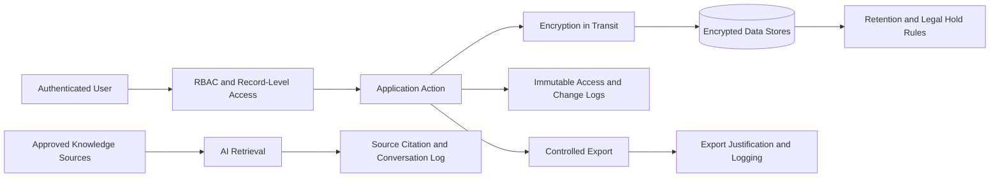

# Data Privacy & Security Assessment

*HSE Safety, Compliance & Intelligence Platform*

Generated on 2026-05-17 from source: HSE_Epics_UserStories_FreightFlexStyle.docx

## Document Control

Version: 1.0

Status: Draft for review

Owner: Project Manager / Product Owner

Source baseline: HSE epics and user stories in HSE_Epics_UserStories_FreightFlexStyle.docx

Review cycle: Business, HSE, IT, Security, Compliance, and Operations review before approval.

## Data Categories

Personal data: employee identity, contact details, training, certification, shift, incident involvement.

Sensitive data: confidential incidents, investigation findings, legal/HR records, medical or injury-related information where captured.

Operational data: permits, assets, audits, CAPAs, risks, vendors, SOPs, and compliance reports.

## Security Controls

SSO/MFA support.

Least privilege RBAC and record-level access control.

Encryption in transit and at rest.

Immutable audit logs.

Secure file upload scanning and storage.

Secrets management.

Vulnerability scanning and patching.

Backup and disaster recovery.

## Privacy Controls

Purpose limitation and minimisation for personal data.

Retention schedules by record type.

Access logging for confidential records.

Export controls and justification for sensitive exports.

Data subject request process where applicable.

Vendor/subprocessor review for cloud, notification, storage, and AI services.

## AI Governance

AI advisor must answer from approved knowledge sources, cite document/version, log conversations for quality review, avoid unsupported regulatory advice, and escalate unanswered questions to human experts.

## Assessment Outcome

Proceed only after completing threat model, privacy review, penetration testing or equivalent security validation, and risk acceptance for any residual high-risk items.

## Visuals

### Data Protection Flow

