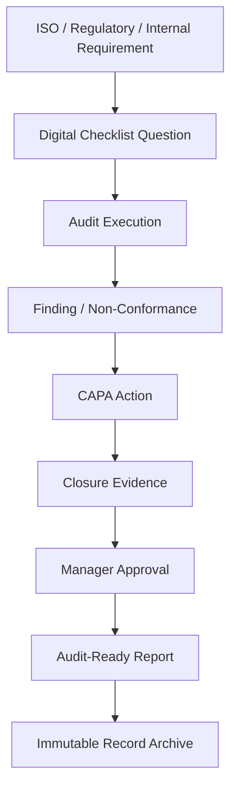

# Compliance/Regulatory Checklist

*HSE Safety, Compliance & Intelligence Platform*

Generated on 2026-05-17 from source: HSE_Epics_UserStories_FreightFlexStyle.docx

## Document Control

Version: 1.0

Status: Draft for review

Owner: Project Manager / Product Owner

Source baseline: HSE epics and user stories in HSE_Epics_UserStories_FreightFlexStyle.docx

Review cycle: Business, HSE, IT, Security, Compliance, and Operations review before approval.

## Checklist Purpose

Provide an initial compliance checklist for project delivery and product readiness. Final obligations must be validated by qualified legal, HSE, and compliance stakeholders for the operating jurisdictions.

## Standards and Frameworks

ISO 45001 occupational health and safety management alignment.

ISO 14001 environmental management alignment.

Internal HSE policies, SOPs, audit protocols, and permit-to-work standards.

Applicable labour, contractor, incident reporting, privacy, cybersecurity, and record retention requirements.

## Product Compliance Checks

Checklist questions can map to ISO clauses.

Audit reports group findings by clause.

CAPA records are traceable to audit and investigation findings.

Permit audit trails are immutable and exportable.

Vendor compliance history is immutable.

Training records include evidence and audit trail.

Confidential incident access is restricted and logged.

## Delivery Compliance Checks

Requirements approved by business and compliance owners.

Security and privacy assessment completed.

Data retention and deletion rules approved.

Accessibility and mobile usability reviewed.

UAT evidence retained.

Go-live approval recorded.

Support and incident response procedures documented.

## Visuals

### Compliance Evidence Chain

