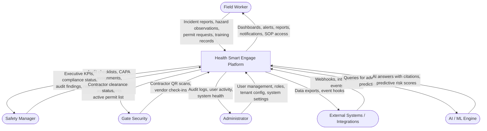
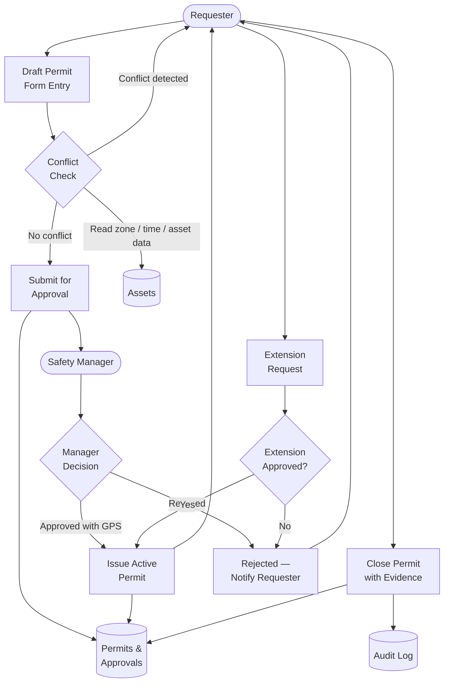
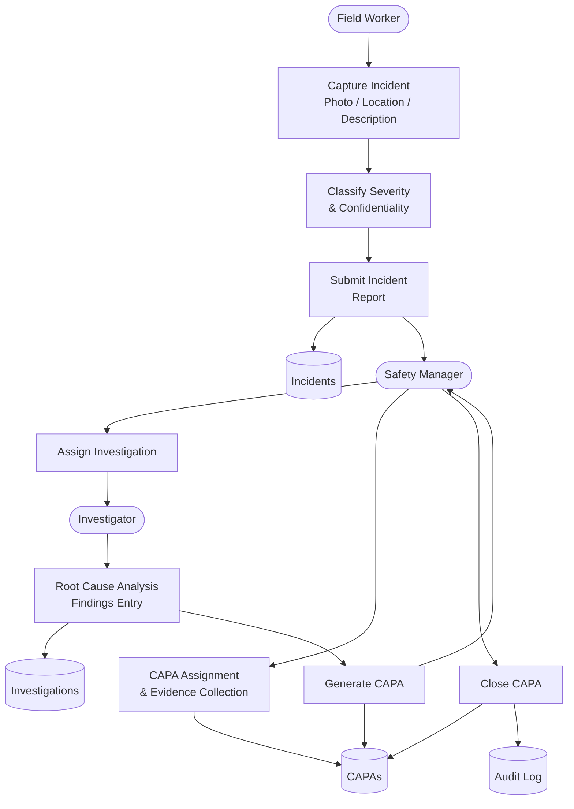

# Data Flow Diagram — Health Smart Engage

## Level 0: Context Diagram

---

## Level 1: Main Process Decomposition

```mermaid
flowchart TD
    %% External Entities
    USER([Users\nField Worker / Manager / Security / Admin])
    AZURE_BLOB([Azure Blob Storage])
    AZURE_KV([Azure Key Vault])
    EXT_SYSTEM([External Systems])
    AI_ENGINE([AI / ML Engine])

    %% Processes
    P1[1. Authentication\n& Authorization]
    P2[2. Permit\nManagement]
    P3[3. Incident &\nInvestigation]
    P4[4. Audit &\nCompliance]
    P5[5. Training &\nCertification]
    P6[6. Vendor\nManagement]
    P7[7. Asset\nManagement]
    P8[8. Risk &\nHazard Tracking]
    P9[9. AI Advisory\n& Predictive Risk]
    P10[10. Notification\n& Reporting]
    P11[11. Mobile Offline\nSync]

    %% Data Stores
    DS1[(Users & Roles)]
    DS2[(Permits &\nApprovals)]
    DS3[(Incidents &\nInvestigations)]
    DS4[(Audits, Findings\n& CAPAs)]
    DS5[(Training &\nCertifications)]
    DS6[(Vendors &\nDocuments)]
    DS7[(Assets &\nInspections)]
    DS8[(Risk Assessments\n& Hazards)]
    DS9[(AI Conversations\n& Risk Scores)]
    DS10[(Files &\nAudit Logs)]
    DS11[(Sync Queue)]

    %% Auth flows
    USER -->|Credentials / Token| P1
    P1 -->|JWT / Session| USER
    P1 <-->|Read roles & permissions| DS1
    AZURE_KV -->|Secrets / Keys| P1

    %% Permit
    USER -->|Create / approve permit| P2
    P2 <-->|Read/write permits| DS2
    P2 -->|Conflict alerts| USER
    P2 -->|Approval events| P10

    %% Incident
    USER -->|Report incident / RCA findings| P3
    P3 <-->|Read/write incidents & investigations| DS3
    P3 -->|CAPA trigger| P4
    P3 -->|Incident alerts| P10

    %% Audit
    USER -->|Execute audit / close CAPA| P4
    P4 <-->|Read/write audits, findings, CAPAs| DS4
    P4 -->|CAPA due alerts| P10

    %% Training
    USER -->|Record completion / upload cert| P5
    P5 <-->|Read/write training & certs| DS5
    P5 -->|Expiry alerts| P10

    %% Vendor
    USER -->|Onboard vendor / upload docs| P6
    P6 <-->|Read/write vendors & docs| DS6
    P6 -->|Approval events| P10

    %% Asset
    USER -->|Register asset / record inspection| P7
    P7 <-->|Read/write assets & inspections| DS7
    P7 -->|Inspection due alerts| P10

    %% Risk & Hazard
    USER -->|Submit hazard / risk assessment| P8
    P8 <-->|Read/write risk assessments & hazards| DS8
    P8 -->|High-risk alerts| P10

    %% AI
    USER -->|Natural-language safety queries| P9
    P9 -->|Query with context| AI_ENGINE
    AI_ENGINE -->|Answers + citations| P9
    P9 <-->|Read/write AI conversations & scores| DS9
    P9 -->|Risk predictions| P8

    %% Notifications & Reports
    P10 -->|Email / push notifications| USER
    P10 -->|Reports / exports| USER
    P10 <-->|Audit log entries| DS10

    %% File storage
    P2 & P3 & P4 & P5 & P6 & P7 -->|Upload evidence / docs| AZURE_BLOB
    AZURE_BLOB -->|SAS URLs| P2 & P3 & P4 & P5 & P6 & P7
    P2 & P3 & P4 & P5 & P6 & P7 -->|File metadata| DS10

    %% Mobile Sync
    USER -->|Offline operations| P11
    P11 <-->|Sync queue| DS11
    P11 -->|Resolved records| DS2 & DS3 & DS4 & DS5 & DS7 & DS8

    %% External integrations
    EXT_SYSTEM <-->|Webhooks / event hooks| P10
```

---

## Level 2: Permit Management Process

---

## Level 2: Incident & Investigation Process

---

## Data Store Summary

| Data Store | Key Entities | Primary Consumers |
|---|---|---|
| Users & Roles | User, Role, OrganisationNode | Auth, RBAC, all processes |
| Permits & Approvals | Permit, PermitApproval | Permit Management |
| Incidents & Investigations | Incident, Investigation | Incident Management |
| Audits, Findings & CAPAs | AuditChecklist, AuditExecution, Finding, Capa | Audit & Compliance |
| Training & Certifications | TrainingRequirement, TrainingCompletion, Certification | Training Management |
| Vendors & Documents | Vendor, VendorDocument | Vendor Management |
| Assets & Inspections | Asset, AssetInspection | Asset Management |
| Risk Assessments & Hazards | RiskAssessment, HazardObservation | Risk & Safety |
| AI Conversations & Scores | AiConversation, PredictiveRiskScore | AI Advisory |
| Files & Audit Logs | FileObject, AuditLog | All processes (cross-cutting) |
| Sync Queue | MobileSyncItem | Mobile Offline Sync |
