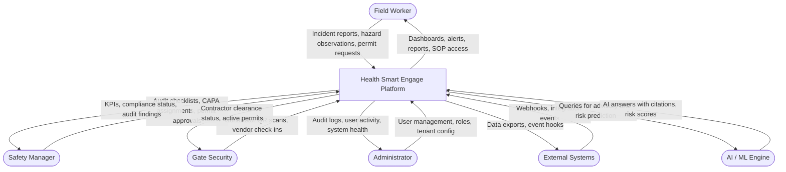
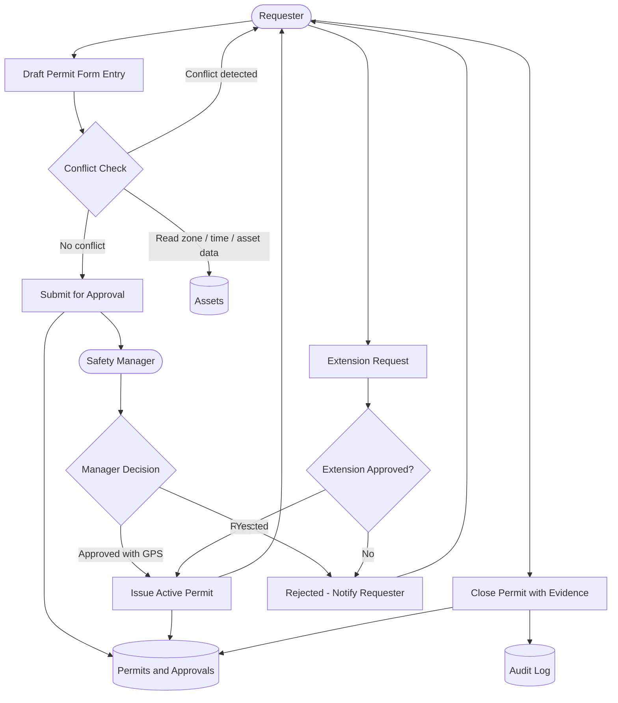
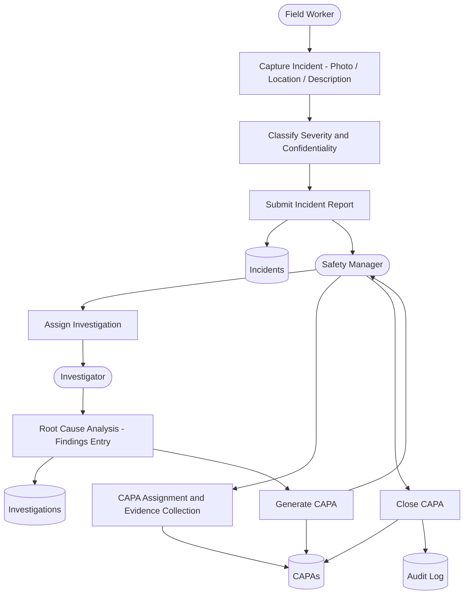

# Data Flow Diagram - Health Smart Engage

## Level 0: Context Diagram

---

## Level 1A: Core Process Data Flows

```mermaid
flowchart TD
    USER([Users])
    AZURE_KV([Azure Key Vault])
    AI_ENGINE([AI / ML Engine])

    P1[1. Auth and Authorization]
    P2[2. Permit Management]
    P3[3. Incident and Investigation]
    P4[4. Audit and Compliance]
    P5[5. Training and Certification]
    P6[6. Vendor Management]
    P7[7. Asset Management]
    P8[8. Risk and Hazard Tracking]
    P9[9. AI Advisory and Predictive Risk]
    P10[10. Notification and Reporting]

    DS1[(Users and Roles)]
    DS2[(Permits and Approvals)]
    DS3[(Incidents and Investigations)]
    DS4[(Audits, Findings and CAPAs)]
    DS5[(Training and Certifications)]
    DS6[(Vendors and Documents)]
    DS7[(Assets and Inspections)]
    DS8[(Risk Assessments and Hazards)]
    DS9[(AI Conversations and Risk Scores)]
    DS10[(Files and Audit Logs)]

    AZURE_KV -->|Secrets and Keys| P1
    USER -->|Credentials / Token| P1
    P1 -->|JWT / Session| USER
    P1 -->|Read roles and permissions| DS1
    DS1 -->|Role and permission data| P1

    USER -->|Create / approve permit| P2
    P2 -->|Read/write permits| DS2
    DS2 -->|Permit data| P2
    P2 -->|Conflict alerts| USER
    P2 -->|Approval events| P10

    USER -->|Report incident / RCA findings| P3
    P3 -->|Read/write incidents| DS3
    DS3 -->|Incident data| P3
    P3 -->|CAPA trigger| P4
    P3 -->|Incident alerts| P10

    USER -->|Execute audit / close CAPA| P4
    P4 -->|Read/write audits, findings, CAPAs| DS4
    DS4 -->|Audit data| P4
    P4 -->|CAPA due alerts| P10

    USER -->|Record completion / upload cert| P5
    P5 -->|Read/write training and certs| DS5
    DS5 -->|Training data| P5
    P5 -->|Expiry alerts| P10

    USER -->|Onboard vendor / upload docs| P6
    P6 -->|Read/write vendors and docs| DS6
    DS6 -->|Vendor data| P6
    P6 -->|Approval events| P10

    USER -->|Register asset / record inspection| P7
    P7 -->|Read/write assets and inspections| DS7
    DS7 -->|Asset data| P7
    P7 -->|Inspection due alerts| P10

    USER -->|Submit hazard / risk assessment| P8
    P8 -->|Read/write risk assessments| DS8
    DS8 -->|Risk data| P8
    P8 -->|High-risk alerts| P10

    USER -->|Natural-language safety queries| P9
    P9 -->|Query with context| AI_ENGINE
    AI_ENGINE -->|Answers and citations| P9
    P9 -->|Read/write AI conversations| DS9
    DS9 -->|Conversation history| P9
    P9 -->|Risk predictions| P8

    P10 -->|Email / push notifications| USER
    P10 -->|Reports and exports| USER
    P10 -->|Audit log entries| DS10
    DS10 -->|Log history| P10
```

---

## Level 1B: File Storage and Mobile Sync

```mermaid
flowchart TD
    AZURE_BLOB([Azure Blob Storage])
    EXT_SYSTEM([External Systems])

    P2[Permit Management]
    P3[Incident Management]
    P4[Audit and Compliance]
    P5[Training Management]
    P6[Vendor Management]
    P7[Asset Management]
    P10[Notification and Reporting]
    P11[Mobile Offline Sync]

    DS2[(Permits)]
    DS3[(Incidents)]
    DS4[(Audits and CAPAs)]
    DS5[(Training)]
    DS7[(Assets)]
    DS8[(Risk and Hazards)]
    DS10[(Files and Audit Logs)]
    DS11[(Sync Queue)]

    USER([Users])

    P2 -->|Upload evidence| AZURE_BLOB
    P3 -->|Upload evidence| AZURE_BLOB
    P4 -->|Upload evidence| AZURE_BLOB
    P5 -->|Upload evidence| AZURE_BLOB
    P6 -->|Upload documents| AZURE_BLOB
    P7 -->|Upload evidence| AZURE_BLOB

    AZURE_BLOB -->|SAS download URLs| P2
    AZURE_BLOB -->|SAS download URLs| P3
    AZURE_BLOB -->|SAS download URLs| P4
    AZURE_BLOB -->|SAS download URLs| P5
    AZURE_BLOB -->|SAS download URLs| P6
    AZURE_BLOB -->|SAS download URLs| P7

    P2 -->|File metadata| DS10
    P3 -->|File metadata| DS10
    P4 -->|File metadata| DS10
    P5 -->|File metadata| DS10
    P6 -->|File metadata| DS10
    P7 -->|File metadata| DS10

    USER -->|Offline operations| P11
    P11 -->|Sync queue read/write| DS11
    DS11 -->|Queue data| P11
    P11 -->|Resolved records| DS2
    P11 -->|Resolved records| DS3
    P11 -->|Resolved records| DS4
    P11 -->|Resolved records| DS5
    P11 -->|Resolved records| DS7
    P11 -->|Resolved records| DS8

    EXT_SYSTEM -->|Webhooks and integration events| P10
    P10 -->|Event hooks| EXT_SYSTEM
```

---

## Level 2: Permit Management Process

---

## Level 2: Incident and Investigation Process

---

## Data Store Summary

| Data Store | Key Entities | Primary Consumers |
|---|---|---|
| Users and Roles | User, Role, OrganisationNode | Auth, RBAC, all processes |
| Permits and Approvals | Permit, PermitApproval | Permit Management |
| Incidents and Investigations | Incident, Investigation | Incident Management |
| Audits, Findings and CAPAs | AuditChecklist, AuditExecution, Finding, Capa | Audit and Compliance |
| Training and Certifications | TrainingRequirement, TrainingCompletion, Certification | Training Management |
| Vendors and Documents | Vendor, VendorDocument | Vendor Management |
| Assets and Inspections | Asset, AssetInspection | Asset Management |
| Risk Assessments and Hazards | RiskAssessment, HazardObservation | Risk and Safety |
| AI Conversations and Scores | AiConversation, PredictiveRiskScore | AI Advisory |
| Files and Audit Logs | FileObject, AuditLog | All processes (cross-cutting) |
| Sync Queue | MobileSyncItem | Mobile Offline Sync |
