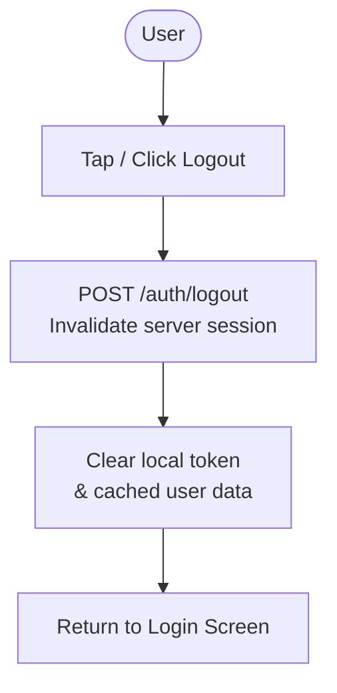
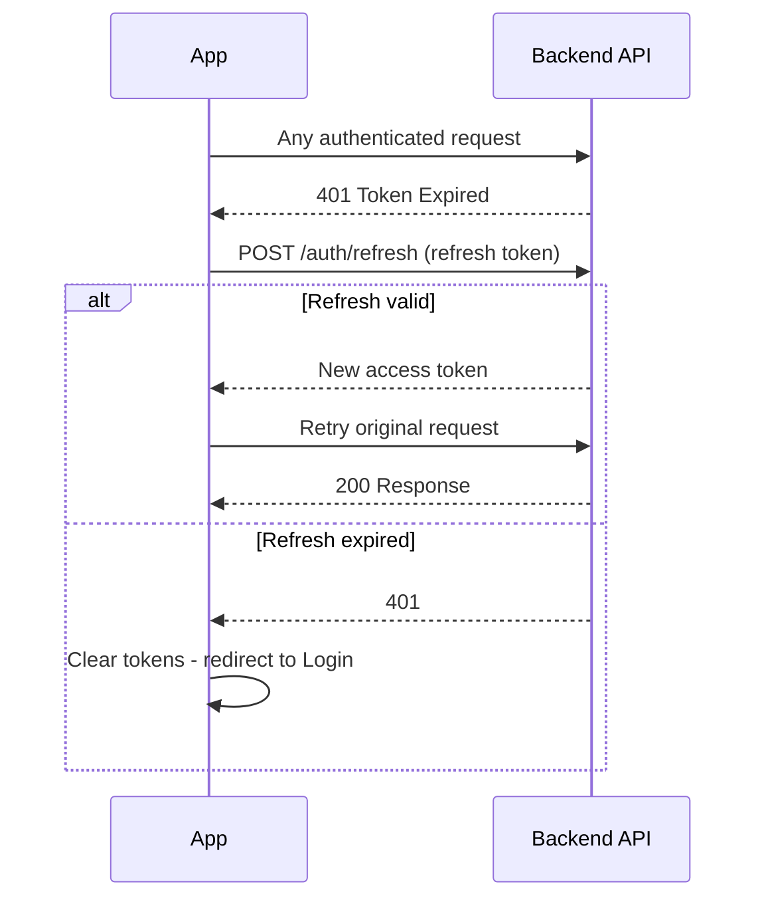

# Login Flow

## Mobile Login Flow (SSO + Email/Password)

```mermaid
flowchart TD
    START([App Launch]) --> SPLASH[Splash Screen\nBranding · Version · Privacy & Terms links]
    SPLASH --> TOKEN_CHECK{Stored Token\nValid?}

    TOKEN_CHECK -->|Yes| REFRESH[Refresh Access Token\nPOST /auth/refresh]
    TOKEN_CHECK -->|No / Expired| LOGIN[Login Screen\nEmail + Password fields\nSSO hint indicator]

    REFRESH --> REFRESH_OK{Token\nRefreshed?}
    REFRESH_OK -->|Yes| FETCH_ME[Fetch User Profile\nGET /auth/me]
    REFRESH_OK -->|No| LOGIN

    LOGIN --> AUTH_CHOICE{Auth\nMethod}

    AUTH_CHOICE -->|Email + Password| CRED[Enter Credentials]
    CRED --> POST_LOGIN[POST /auth/login]
    POST_LOGIN --> LOGIN_RESP{Response}
    LOGIN_RESP -->|401 Invalid| ERROR_MSG[Show Error Message\nInvalid email or password]
    ERROR_MSG --> LOGIN
    LOGIN_RESP -->|200 OK| MFA_CHECK

    AUTH_CHOICE -->|SSO / Enterprise| SSO_START[GET /auth/sso/{providerKey}/start\nRedirect to Identity Provider]
    SSO_START --> IDP[Identity Provider\nAzure AD / Okta / etc.]
    IDP --> CORP_CREDS[User enters\nCorporate Credentials]
    CORP_CREDS --> MFA_IDP{MFA\nRequired?}
    MFA_IDP -->|Yes| MFA_IDP_ENTER[Enter OTP /\nAuthenticator Code]
    MFA_IDP_ENTER --> SSO_CB
    MFA_IDP -->|No| SSO_CB
    SSO_CB[GET /auth/sso/{providerKey}/callback\nToken validated & JWT issued]
    SSO_CB --> MFA_CHECK

    MFA_CHECK{App-level MFA\nRequired?}
    MFA_CHECK -->|Yes| MFA_SCREEN[Enter OTP /\nAuthenticator Code]
    MFA_SCREEN --> MFA_VALID{Valid?}
    MFA_VALID -->|No| MFA_SCREEN
    MFA_VALID -->|Yes| FETCH_ME
    MFA_CHECK -->|No| FETCH_ME

    FETCH_ME --> PROFILE[GET /auth/me\nReturns: tenant_id · site_id\nuser_id · roles · permissions]

    PROFILE --> SITE_CHECK{Multiple\nSites Assigned?}
    SITE_CHECK -->|Yes| SITE_SEL[Site Selection Screen\nSearch · Remember selection]
    SITE_SEL --> SITE_PICKED[User picks site]
    SITE_PICKED --> ROLE_NAV
    SITE_CHECK -->|No| ROLE_NAV

    ROLE_NAV{Role-Based\nNavigator}
    ROLE_NAV -->|FIELD_WORKER| FW_DASH[Field Worker Dashboard\nQuick actions: Report · Hazard · Permit · Scan]
    ROLE_NAV -->|SAFETY_MANAGER| SM_DASH[Safety Manager Dashboard\nLive board · Approvals · Audits]
    ROLE_NAV -->|GATE_SECURITY| GS_DASH[Gate Security Dashboard\nScan QR · Vendor status · Permits]
    ROLE_NAV -->|SYSTEM_ADMIN| ADM_DASH[Admin Dashboard\nUser mgmt · Roles · Settings]
    ROLE_NAV -->|EXECUTIVE| EX_DASH[Executive Dashboard\nKPIs · Trends · Reports]
```

---

## Web Platform Login Flow

```mermaid
flowchart TD
    START([Browser - App URL]) --> AUTH_GATE{Session\nCookie Valid?}
    AUTH_GATE -->|Yes| DASHBOARD[Redirect to Role Dashboard]
    AUTH_GATE -->|No| WEB_LOGIN[Web Login Page\nEmail + Password / SSO button]

    WEB_LOGIN --> WEB_CHOICE{Auth\nMethod}

    WEB_CHOICE -->|Email + Password| WEB_CRED[Enter Credentials\nPOST /auth/login]
    WEB_CRED --> WEB_RESP{Response}
    WEB_RESP -->|401| WEB_ERR[Show Error]
    WEB_ERR --> WEB_LOGIN
    WEB_RESP -->|200| WEB_PROFILE

    WEB_CHOICE -->|SSO| SSO_REDIRECT[Redirect to SSO Provider\nGET /auth/sso/{providerKey}/start]
    SSO_REDIRECT --> IDP[Identity Provider Login]
    IDP --> SSO_BACK[GET /auth/sso/{providerKey}/callback]
    SSO_BACK --> WEB_PROFILE

    WEB_PROFILE[GET /auth/me - Load Role + Permissions]
    WEB_PROFILE --> DASHBOARD
    DASHBOARD --> ROLE_PAGE{User Role}
    ROLE_PAGE -->|Safety Manager| SM_WEB[Site HSE Command Dashboard]
    ROLE_PAGE -->|Admin| ADM_WEB[Admin Console]
    ROLE_PAGE -->|Executive| EX_WEB[Executive Intelligence Dashboard]
```

---

## Logout Flow



---

## Token Refresh Flow (Background)


