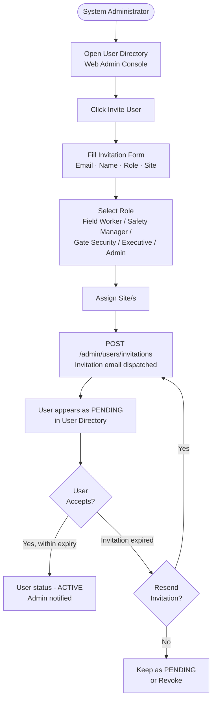
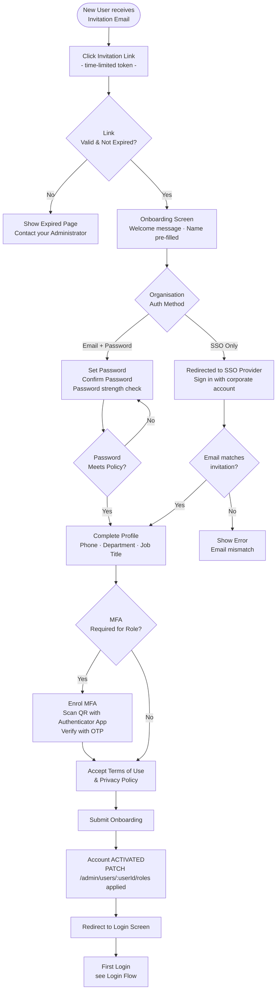
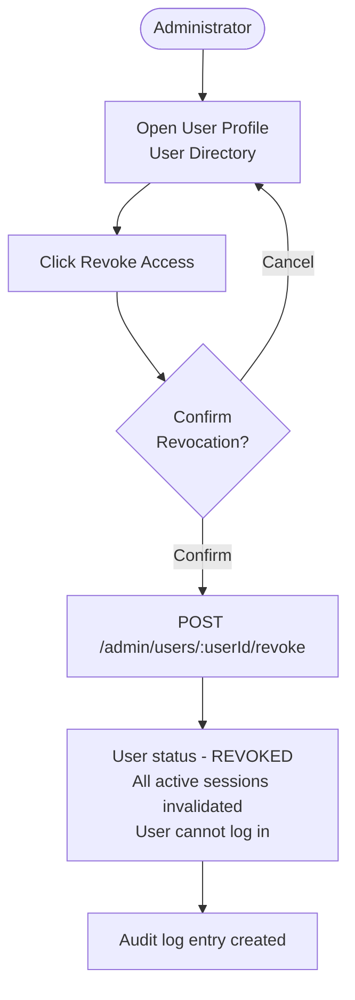
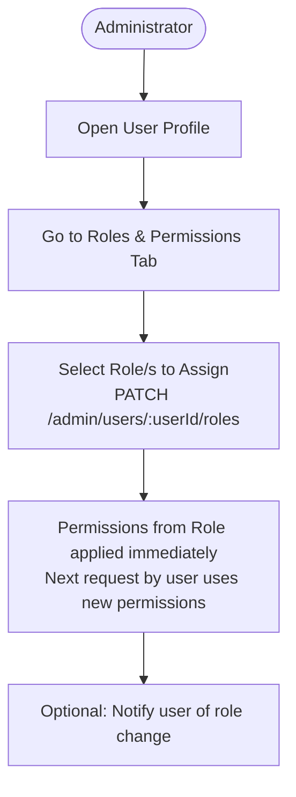

# User Invitation & Onboarding Flow

> Health Smart Engage is an enterprise platform. There is no public self-registration.
> New users are invited by a System Administrator via email invitation.

## Invitation Flow (Admin Side)

---

## Onboarding Flow (New User Side)

---

## Admin: Revoke / Deactivate User Flow

---

## Role Assignment Flow

