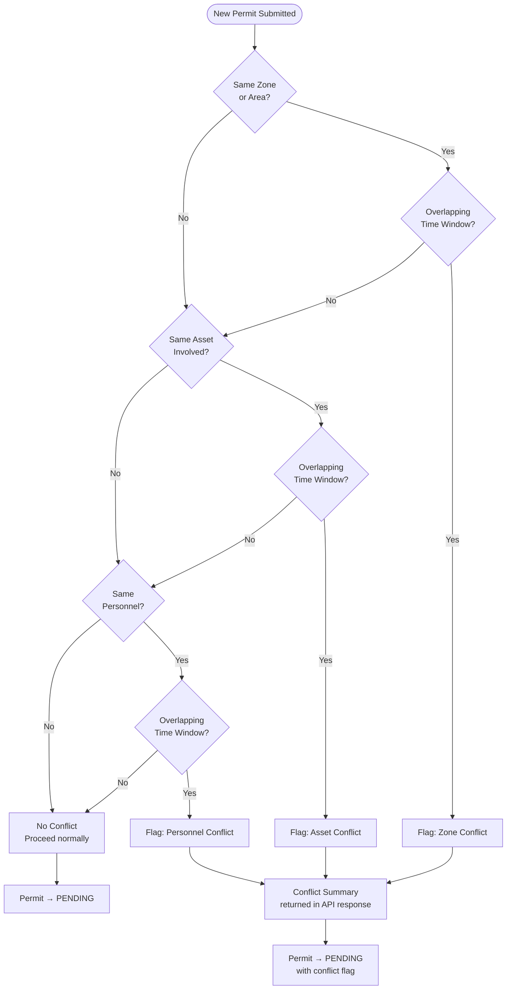

# Work Permit Flow

## Full Permit Lifecycle

```mermaid
flowchart TD
    FW([Field Worker]) --> PERMIT_SCREEN[Open Permit Request Screen\nMobile App]
    PERMIT_SCREEN --> FILL_FORM[Fill Permit Form\nWork type · Zone / Area\nStart & End time · Assets involved\nHazards · Control measures]

    FILL_FORM --> ASSET_LOOKUP{Asset\nIdentification}
    ASSET_LOOKUP -->|Search by name| ASSET_SEARCH[GET /mobile/assets/search]
    ASSET_LOOKUP -->|QR Scan| QR_SCAN[Scan Asset QR Code]
    QR_SCAN --> ASSET_FOUND[Asset details auto-filled]
    ASSET_SEARCH --> ASSET_FOUND

    ASSET_FOUND --> CONTROLS_CHECK[Complete Controls Checklist\nLOTO · PPE · Isolation\nHot work · Confined space]
    CONTROLS_CHECK --> SIGN[Capture Authorization Signature]
    SIGN --> SUBMIT_PERMIT[Submit Permit\nPOST /mobile/permits]

    SUBMIT_PERMIT --> CONFLICT_CHECK{Backend:\nConflict Check\nSame zone / asset / time}
    CONFLICT_CHECK -->|Conflict Detected| CONFLICT_WARN[Show Conflict Warning\nOverlapping permit details]
    CONFLICT_WARN --> EDIT_CHOICE{User\nAction}
    EDIT_CHOICE -->|Edit permit| FILL_FORM
    EDIT_CHOICE -->|Submit anyway| PENDING_CONFLICT[Permit → PENDING\nConflict flag attached]

    CONFLICT_CHECK -->|No Conflict| PENDING[Permit → PENDING\nSafety Manager notified]
    PENDING_CONFLICT --> MANAGER_NOTIFY

    PENDING --> MANAGER_NOTIFY[Safety Manager receives\nPush / Email notification]

    MANAGER_NOTIFY --> SM([Safety Manager])
    SM --> REVIEW_Q[Open Permit Review Queue\nGET /permits/{permitId}]
    REVIEW_Q --> CONFLICT_VIEW{Review\nConflict Details?}
    CONFLICT_VIEW -->|Yes| CONFLICT_PAGE[View Concurrent Permit\nConflict Map\nGET /permits/{permitId}/conflicts]
    CONFLICT_PAGE --> DECISION
    CONFLICT_VIEW -->|No| DECISION

    DECISION{Approve or\nReject?}
    DECISION -->|Approve| APPROVAL[POST /permits/{permitId}/approve\nGPS location captured\nTimestamp recorded]
    APPROVAL --> ACTIVE[Permit → ACTIVE\nRequester notified\n8-hour validity warning shown]

    DECISION -->|Reject| REJECTION[POST /permits/{permitId}/reject\nReason entered]
    REJECTION --> REJECTED_NOTIF[Permit → REJECTED\nRequester notified with reason]
    REJECTED_NOTIF --> FW

    ACTIVE --> WORK[Work in Progress\nPermit visible on Live Board]

    WORK --> EXTEND_Q{Extension\nNeeded?}
    EXTEND_Q -->|Yes| EXT_REQ[POST /mobile/permits/{permitId}/extend\nNew end time requested]
    EXT_REQ --> SM
    SM --> EXT_DECISION{Approve\nExtension?}
    EXT_DECISION -->|Yes| POST_EXTEND[POST /permits/{permitId}/extend\nValidity extended]
    POST_EXTEND --> ACTIVE
    EXT_DECISION -->|No| FW

    EXTEND_Q -->|No| CLOSE_FLOW

    CLOSE_FLOW[Ready to Close]
    CLOSE_FLOW --> EVIDENCE[Upload Closure Evidence\nPhotos · Sign-off · Notes]
    EVIDENCE --> CLOSE[POST /mobile/permits/{permitId}/close]
    CLOSE --> CLOSED[Permit → CLOSED\nAudit log updated]
    CLOSED --> AUDIT_LOG[(Audit Log)]
```

---

## Permit Live Board (Safety Manager View)

```mermaid
flowchart TD
    SM([Safety Manager]) --> LIVE_BOARD[Open Live Permit Board\nGET /mobile/permits/live-board\nor GET /dashboards/permit-live-board]
    LIVE_BOARD --> FILTER[Filter by Status\nACTIVE · PENDING · CLOSED · REJECTED]
    FILTER --> VIEW_LIST[List of permits\nID · Title · Holder · Zone · Status · Expiry]

    VIEW_LIST --> SELECT[Select a Permit]
    SELECT --> DETAIL[Permit Detail View]
    DETAIL --> ACTIONS{Action}
    ACTIONS -->|Approve pending| APPROVAL[POST /permits/{id}/approve]
    ACTIONS -->|Reject pending| REJECTION[POST /permits/{id}/reject]
    ACTIONS -->|Override conflict| OVERRIDE[POST /permits/{id}/override-conflict\nReason required]
    ACTIONS -->|Close active| CLOSE_SM[POST /permits/{id}/close]
    ACTIONS -->|View audit trail| TRAIL[GET /audit-logs/record/permit/{id}]
    ACTIONS -->|Export| EXPORT[POST /reports/permits/export]
```

---

## Conflict Detection Logic


