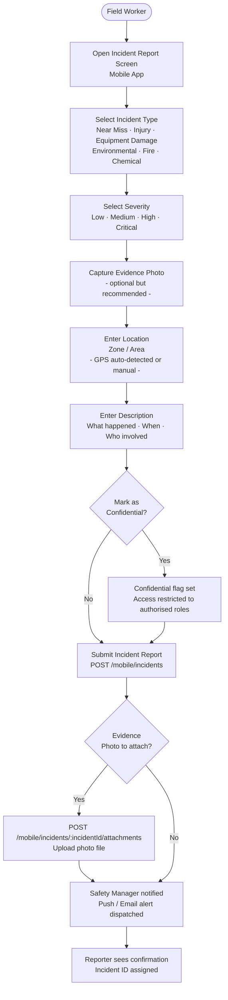
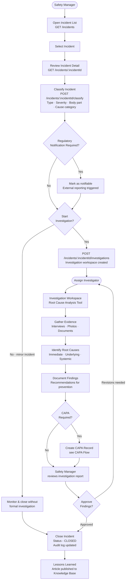
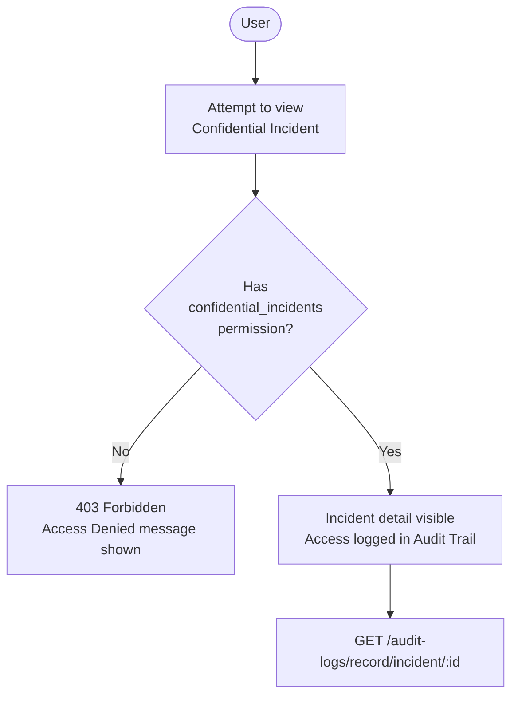
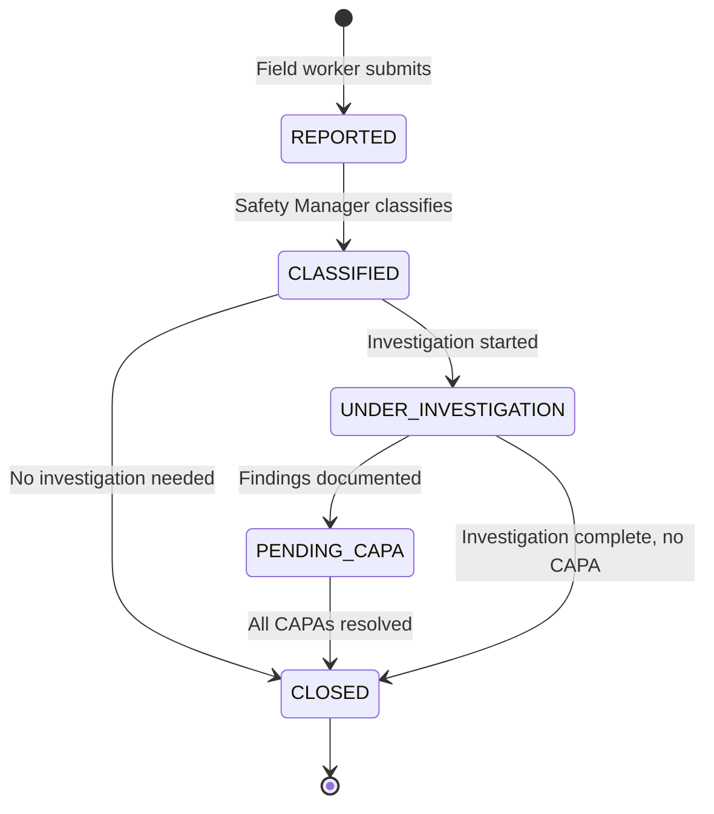

# Incident Reporting & Investigation Flow

## Incident Report Submission (Mobile)

---

## Incident Classification & Investigation (Safety Manager)

---

## Confidential Incident Access Flow

---

## Incident States

