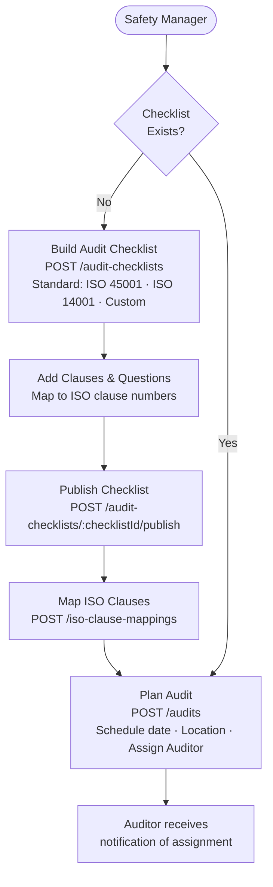
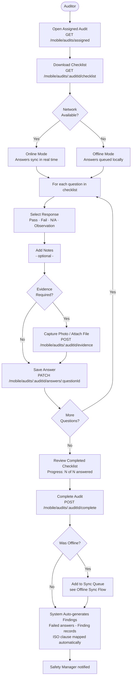
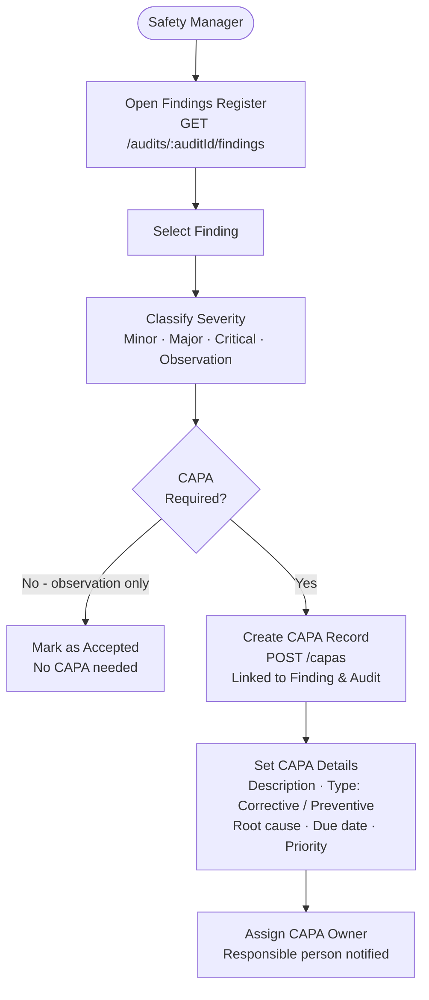
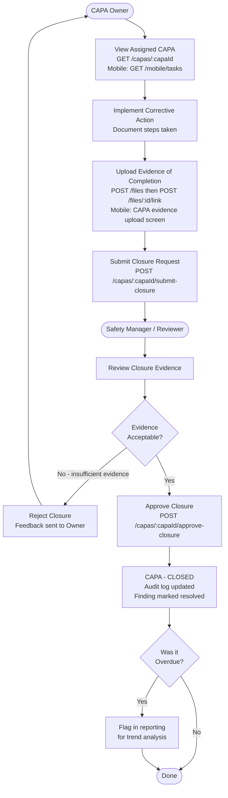
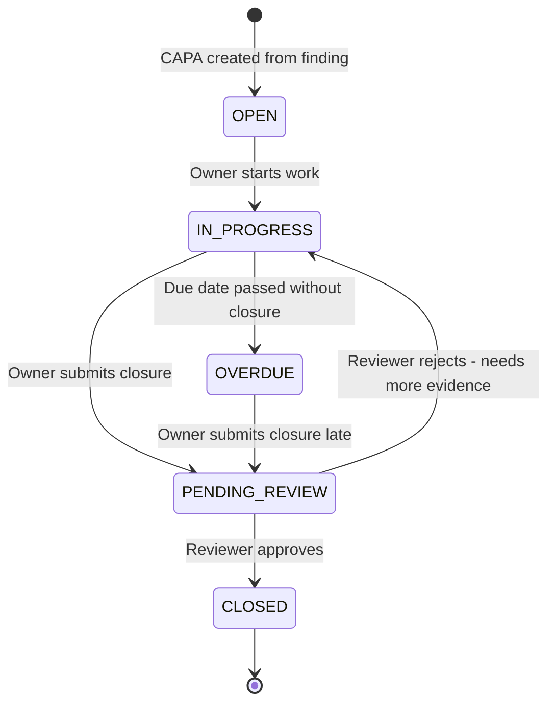
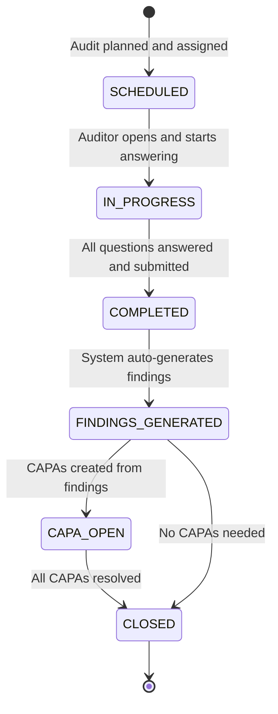

# Audit Execution & CAPA Flow

## Audit Planning & Scheduling

---

## Audit Execution (Mobile - On Site)

---

## Findings Review & CAPA Creation

---

## CAPA Execution & Closure Flow

---

## CAPA States

---

## Audit States

