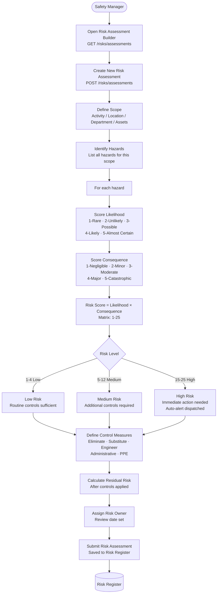
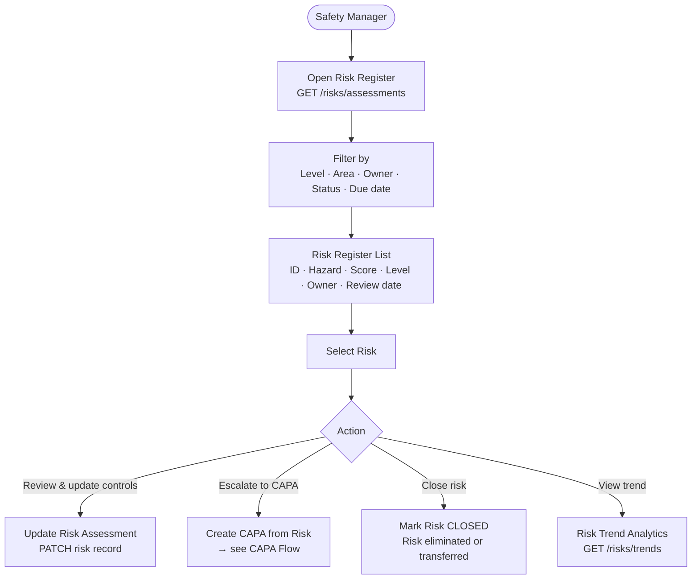
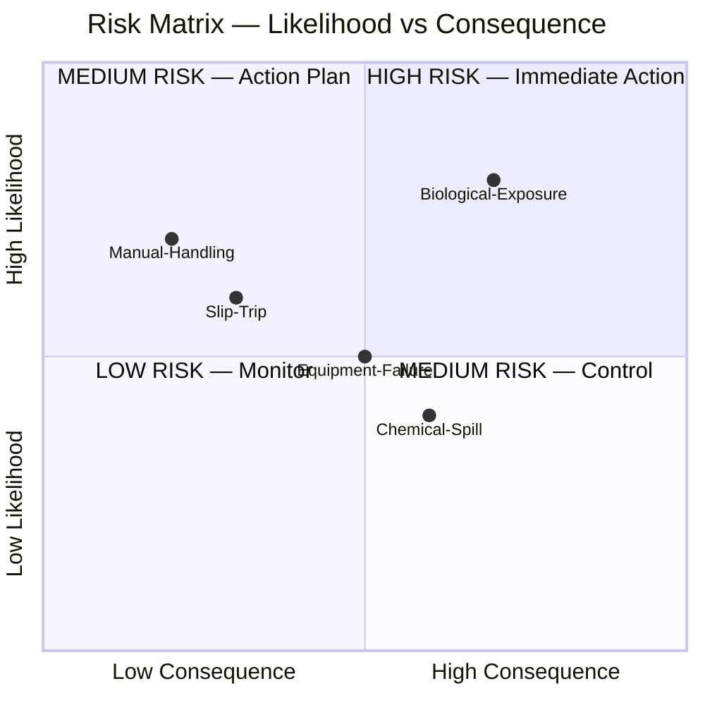
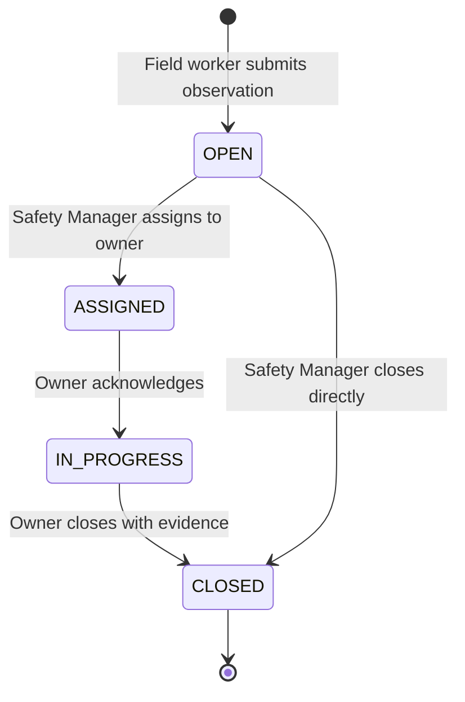

# Hazard Observation & Risk Assessment Flow

## Hazard Observation (Mobile — Quick Capture)

```mermaid
flowchart TD
    FW([Field Worker]) --> HAZ_SCREEN[Open Hazard Observation Screen\nMobile App]
    HAZ_SCREEN --> HAZ_TYPE[Select Hazard Type\nPhysical · Chemical · Biological\nErgonomic · Electrical · Behavioural]
    HAZ_TYPE --> LOCATION[Enter Location\nGPS auto-detected or manual zone entry]
    LOCATION --> DESCRIPTION[Describe the Hazard\nWhat was observed · Potential consequences]
    DESCRIPTION --> PHOTO[Capture Photo\n— recommended —]
    PHOTO --> SEVERITY_EST[Estimate Severity\nLow · Medium · High · Critical]
    SEVERITY_EST --> SUBMIT_HAZ[Submit Hazard Observation\nPOST /mobile/hazards]
    SUBMIT_HAZ --> CONFIRM[Observation ID assigned\nSafety Manager notified]

    CONFIRM --> SM([Safety Manager])
    SM --> ASSIGN{Assign to\nsomeone?}
    ASSIGN -->|Yes| ASSIGN_OWNER[Assign to responsible person\nOwner notified]
    ASSIGN_OWNER --> OWNER([Assigned Owner])
    OWNER --> ACTION[Take corrective action\nDocument steps]
    ACTION --> CLOSE_HAZ[Close Hazard\nPOST /mobile/hazards/{hazardId}/close]
    ASSIGN -->|No — SM handles| CLOSE_HAZ

    CLOSE_HAZ --> CLOSED_HAZ[Hazard → CLOSED\nAudit log updated]
```

---

## Risk Assessment Flow (Web)



---

## Risk Register & Review Flow



---

## Risk Score Matrix



---

## Hazard Observation States


