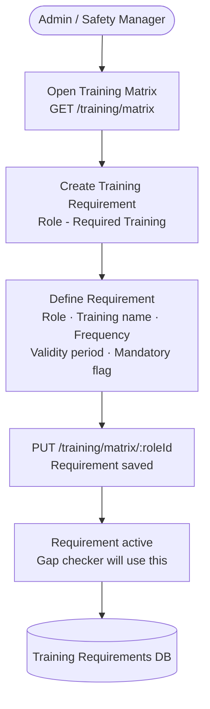
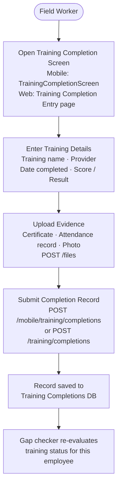
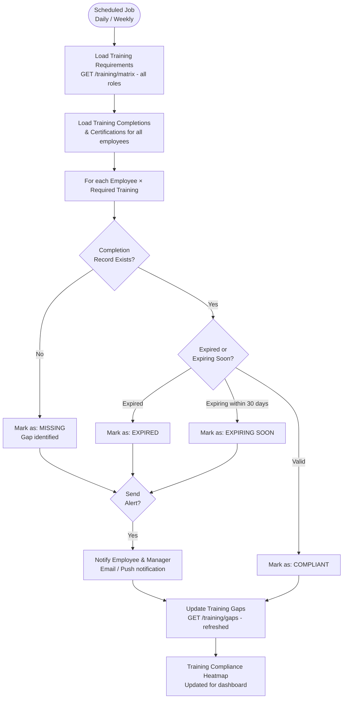
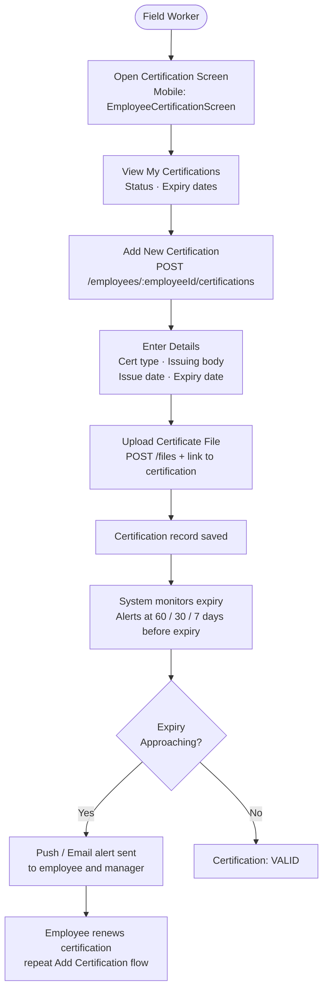
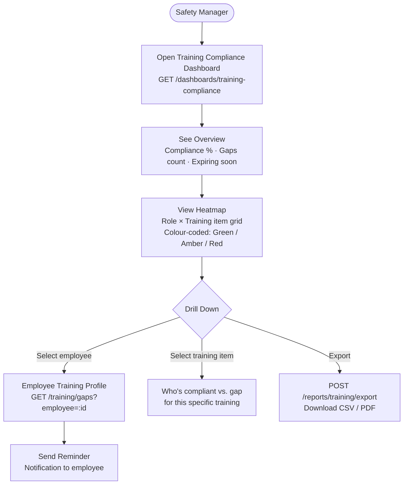

# Training & Certification Flow

## Training Matrix Setup (Admin / Manager)

---

## Training Completion Recording (Mobile / Web)

---

## Training Gap Detection & Alerts (System / Scheduler)

---

## Certification Management Flow

---

## Training Compliance Dashboard (Safety Manager)

