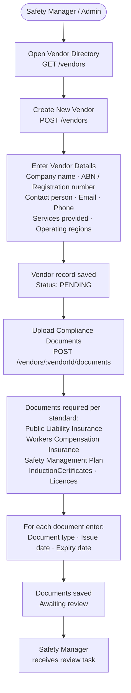
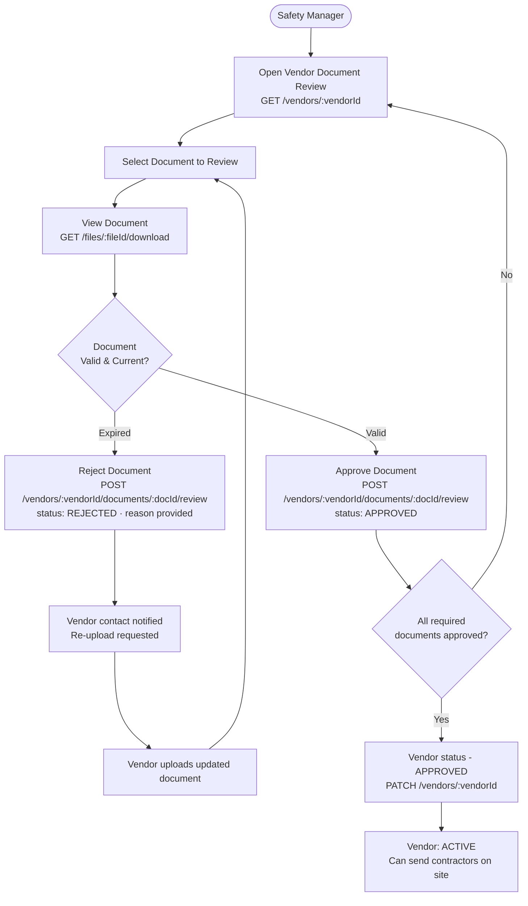
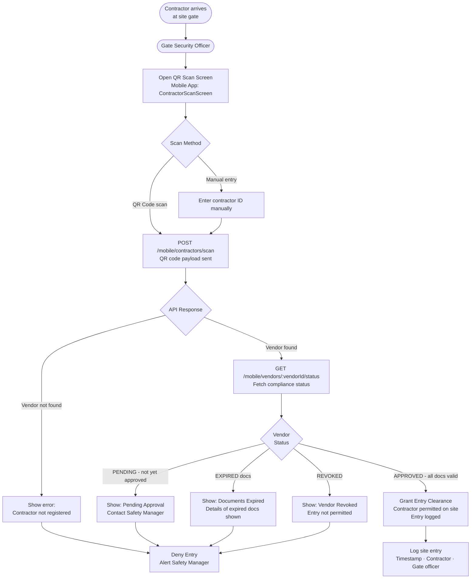
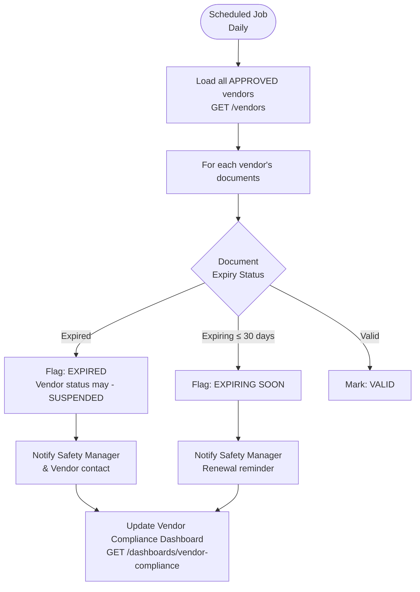
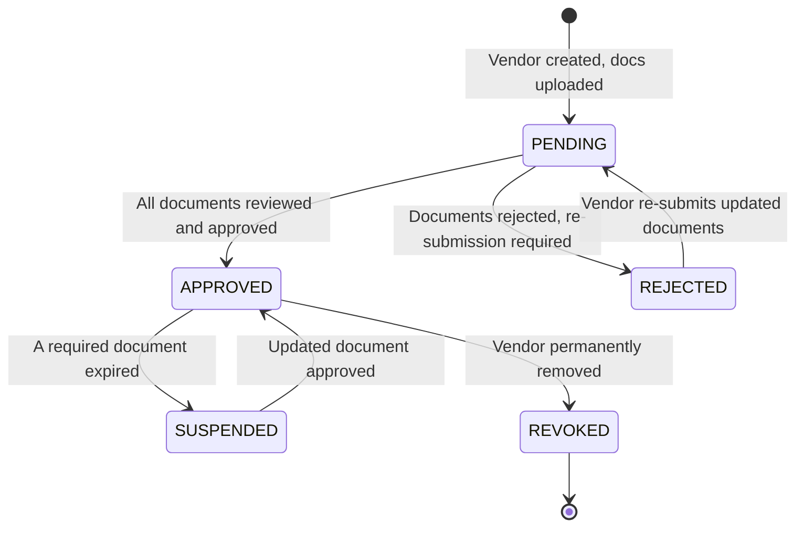

# Vendor & Contractor Management Flow

## Vendor Onboarding Flow

---

## Vendor Document Review Flow

---

## Contractor Site Entry Flow (Gate Security)

---

## Vendor Expiry Monitoring (System)

---

## Vendor States

