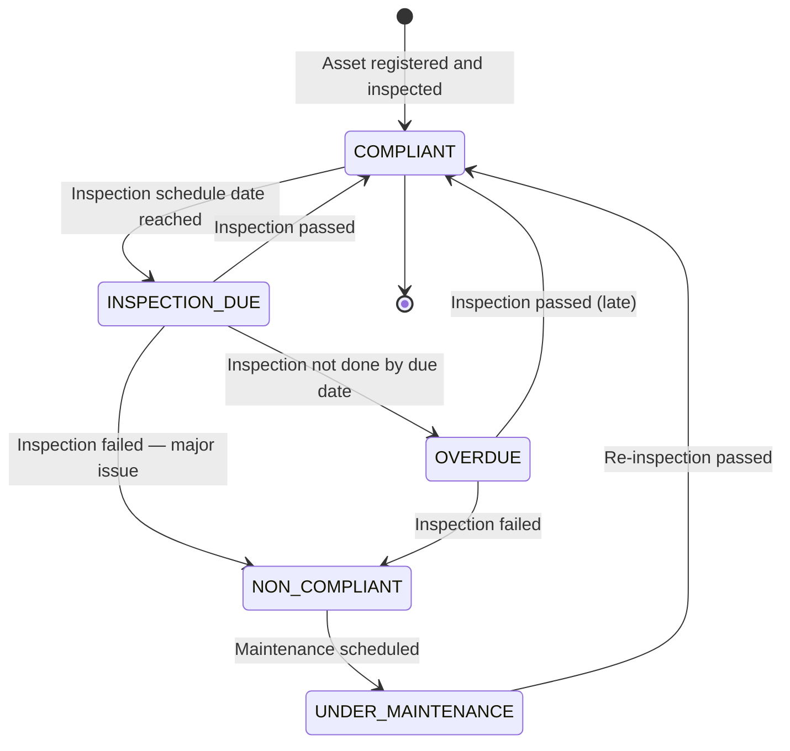

# Asset Management & Inspection Flow

## Asset Registration Flow

```mermaid
flowchart TD
    ADM([Admin / Safety Manager]) --> ASSET_REG[Open Asset Register\nGET /assets]
    ASSET_REG --> NEW_ASSET[Create New Asset\nPOST /assets]
    NEW_ASSET --> ASSET_FORM[Enter Asset Details\nAsset code · Name · Type · Description\nLocation / Zone · Criticality level\nManufacturer · Serial number · Install date]
    ASSET_FORM --> CRITICALITY{Criticality\nLevel}
    CRITICALITY -->|Low| LOW_ASSET[Standard inspection schedule]
    CRITICALITY -->|Medium| MED_ASSET[Increased inspection frequency]
    CRITICALITY -->|High / Safety Critical| HIGH_ASSET[Mandatory inspection before use\nEscalated alerts on failure]
    LOW_ASSET & MED_ASSET & HIGH_ASSET --> COMPLIANCE_RULES[Define Compliance Rules\nPUT /asset-compliance-rules/{ruleId}\nInspection frequency · Checklist · Standards]
    COMPLIANCE_RULES --> ASSET_SAVED[Asset saved to register\nInspection schedule generated]
    ASSET_SAVED --> QR_GEN[Generate QR code for asset tag\nPrint and attach to physical asset]
```

---

## Asset Lookup (Mobile — Field Worker)

```mermaid
flowchart TD
    FW([Field Worker]) --> LOOKUP_SCREEN[Open Asset Lookup Screen\nMobile: AssetLookupScreen]
    LOOKUP_SCREEN --> FIND_METHOD{Find Asset}
    FIND_METHOD -->|Search by name / code| SEARCH[GET /mobile/assets/search?q={query}]
    FIND_METHOD -->|Scan QR on equipment| QR_SCAN[Scan asset QR code]
    QR_SCAN --> SEARCH_BY_CODE[GET /mobile/assets/search?qr={code}]

    SEARCH & SEARCH_BY_CODE --> ASSET_RESULT[Asset result displayed\nName · Code · Location · Status]
    ASSET_RESULT --> STATUS[View Compliance Status\nGET /mobile/assets/{assetId}/status]
    STATUS --> STATUS_CHECK{Compliance\nStatus}
    STATUS_CHECK -->|COMPLIANT| PROCEED[Asset safe to use\nProceed with work]
    STATUS_CHECK -->|INSPECTION DUE| WARN_INSP[Warning: Inspection overdue\nRecord inspection before use]
    STATUS_CHECK -->|NON-COMPLIANT| BLOCK[Do not use this asset\nNotify Safety Manager]
    WARN_INSP --> INSPECT_FLOW[→ Asset Inspection Flow]
```

---

## Asset Inspection Flow (Mobile)

```mermaid
flowchart TD
    INSPECTOR([Inspector / Field Worker]) --> INSP_SCREEN[Open Asset Inspection Screen\nMobile: AssetInspectionScreen]
    INSP_SCREEN --> LOAD_ASSET[Load Asset by code / QR scan\nGET /mobile/assets/{assetId}/status]
    LOAD_ASSET --> CHECKLIST_ITEMS[Load Inspection Checklist\nItems defined in compliance rules]
    CHECKLIST_ITEMS --> INSPECT_LOOP[For each inspection item]
    INSPECT_LOOP --> ITEM_RESULT[Record result\nPass · Fail · N/A]
    ITEM_RESULT --> NOTES_Q{Notes or\nEvidence needed?}
    NOTES_Q -->|Yes| ADD_NOTES[Add notes · Capture photo\n— especially for Fail items —]
    NOTES_Q -->|No| NEXT_ITEM
    ADD_NOTES --> NEXT_ITEM
    NEXT_ITEM{More\nItems?}
    NEXT_ITEM -->|Yes| INSPECT_LOOP
    NEXT_ITEM -->|No| OVERALL_RESULT

    OVERALL_RESULT{Overall\nOutcome}
    OVERALL_RESULT -->|All pass| PASS_INSP[Record PASS\nPOST /mobile/assets/{assetId}/inspections\nAsset status → COMPLIANT]
    OVERALL_RESULT -->|Any fail| FAIL_INSP[Record FAIL\nPOST /mobile/assets/{assetId}/inspections\nFailure items listed]

    PASS_INSP --> NEXT_INSP_DATE[Next inspection date\nautomatically calculated]
    FAIL_INSP --> FAIL_ACTION{Severity\nof Failure}
    FAIL_ACTION -->|Minor| MAINTENANCE[Schedule maintenance\nAsset still usable with caution]
    FAIL_ACTION -->|Major / Safety-critical| QUARANTINE[Quarantine asset\nStatus → NON-COMPLIANT\nSafety Manager alerted\nDo not use tag applied]
    MAINTENANCE & QUARANTINE --> CAPA_Q{CAPA\nRequired?}
    CAPA_Q -->|Yes| CAPA_LINK[Create CAPA from inspection failure\n→ see CAPA Flow]
    CAPA_Q -->|No| DONE([Done])
    CAPA_LINK --> DONE
```

---

## Asset Compliance Dashboard (Safety Manager)

```mermaid
flowchart TD
    SM([Safety Manager]) --> ASSET_DASH[Open Asset Compliance Dashboard\nGET /dashboards/asset-compliance]
    ASSET_DASH --> OVERVIEW[See Overview\nCompliant · Due · Overdue · Non-compliant counts]
    OVERVIEW --> FILTER[Filter by\nCriticality · Location · Type · Status]
    FILTER --> ASSET_LIST[Asset list\nColour-coded by status]
    ASSET_LIST --> SELECT_ASSET[Select Asset]
    SELECT_ASSET --> ACTIONS{Action}
    ACTIONS -->|View inspection history| HISTORY[GET /assets/{assetId}/inspections]
    ACTIONS -->|Schedule inspection| SCHEDULE[Create inspection task\nassign to inspector]
    ACTIONS -->|Update compliance rules| RULES[PUT /asset-compliance-rules/{ruleId}]
    ACTIONS -->|Export| EXPORT[POST /reports/assets/export]
```

---

## Asset Inspection States


