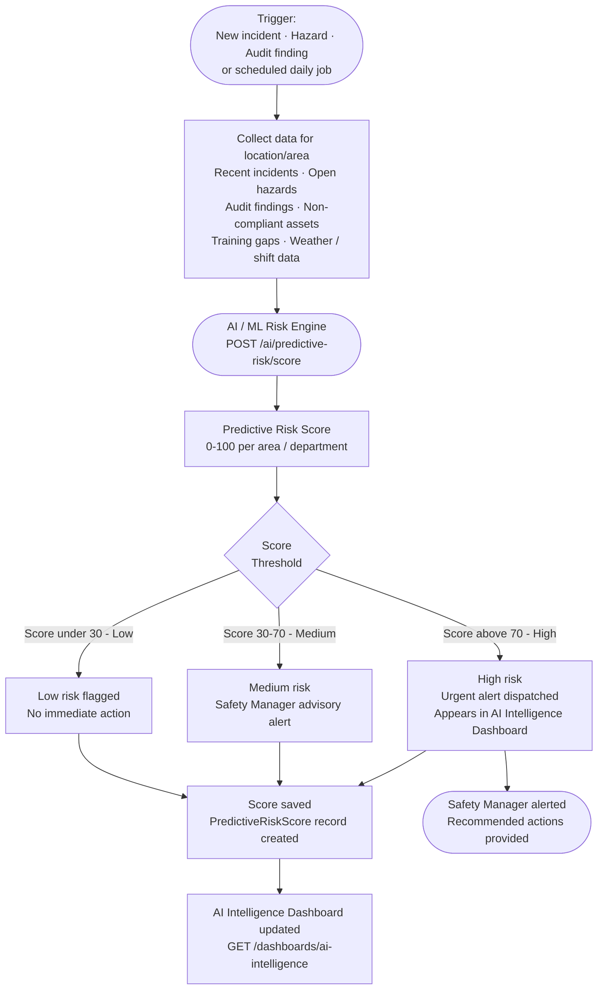
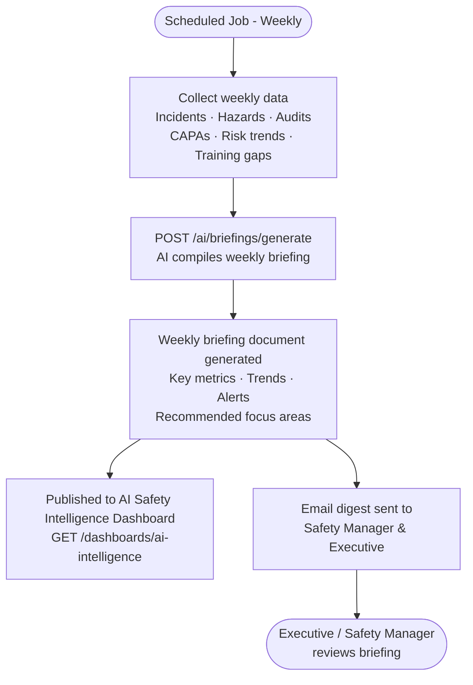

# AI Safety Advisor Flow

## AI Advisor - Query & Response Flow

```mermaid
flowchart TD
    USER([Any User\nField Worker / Manager / Executive]) --> AI_SCREEN[Open AI Safety Advisor\nMobile: AIAdvisorScreen\nWeb: AI Safety Advisor Chat page]

    AI_SCREEN --> PREV_HISTORY{Previous\nConversations?}
    PREV_HISTORY -->|Yes| LOAD_HIST[Load conversation history\nGET /mobile/ai/conversations\nor GET /ai/conversations]
    PREV_HISTORY -->|No| NEW_CONV[Start new conversation]
    LOAD_HIST --> INPUT_AREA
    NEW_CONV --> INPUT_AREA

    INPUT_AREA[User types safety question\nExamples:\n- What PPE is needed for confined space entry?\n- Show me the hot work permit requirements\n- What are the steps for LOTO?\n- What are our chemical spill procedures?]

    INPUT_AREA --> SUBMIT_Q[Submit Query\nPOST /mobile/ai/advisor/query\nor POST /ai/advisor/query]

    SUBMIT_Q --> AI_BACKEND[AI Service\nProcesses query]
    AI_BACKEND --> CONTEXT_FETCH[Retrieve relevant context\n- Knowledge documents / SOPs\n- Past incident reports\n- Risk assessments\n- Regulatory standards]
    CONTEXT_FETCH --> AI_ENGINE([AI / ML Engine\nGenerates answer])
    AI_ENGINE --> RESPONSE[Answer generated\nWith source citations]

    RESPONSE --> DISPLAY[Display answer in chat\nWith linked source documents]
    DISPLAY --> SOURCES[Show citation list\n- Document name · Revision · Clause]
    SOURCES --> USER_ACTION{User\nAction}

    USER_ACTION -->|Ask follow-up| INPUT_AREA
    USER_ACTION -->|Open cited document| SOP_VIEW[View SOP / Document\nGET /knowledge/documents/{documentId}]
    USER_ACTION -->|Give feedback| FEEDBACK[Submit Feedback\nPOST /mobile/ai/responses/{responseId}/feedback\nHelpful · Not helpful · Inaccurate]
    USER_ACTION -->|End session| SAVE_CONV[Conversation saved\nto AI Conversations history]

    FEEDBACK --> FEEDBACK_USED[Feedback used to\nimprove AI responses]
    SOP_VIEW --> USER_ACTION
```

---

## Predictive Risk Scoring Flow (Background)



---

## AI Weekly Safety Briefing Flow



---

## Knowledge Search Flow

```mermaid
flowchart TD
    USER([User]) --> SEARCH_INPUT[Enter search query\nGET /mobile/knowledge/search?q={query}\nor GET /search/knowledge?q={query}]
    SEARCH_INPUT --> RESULTS[Search results displayed\nDocument title · Tag · Revision · Date]
    RESULTS --> SELECT_DOC[Select document]
    SELECT_DOC --> VIEW_DOC[View SOP / Knowledge Document\nGET /mobile/knowledge/documents/{documentId}\nor GET /knowledge/documents/{documentId}]
    VIEW_DOC --> ACK_Q{Acknowledge\nrequired?}
    ACK_Q -->|Yes| ACK[Tap Acknowledge\nPOST /mobile/knowledge/documents/{documentId}/acknowledge]
    ACK --> RECORD[Read acknowledgement\nrecorded against user]
    ACK_Q -->|No| READ_ONLY[Read only]
```
