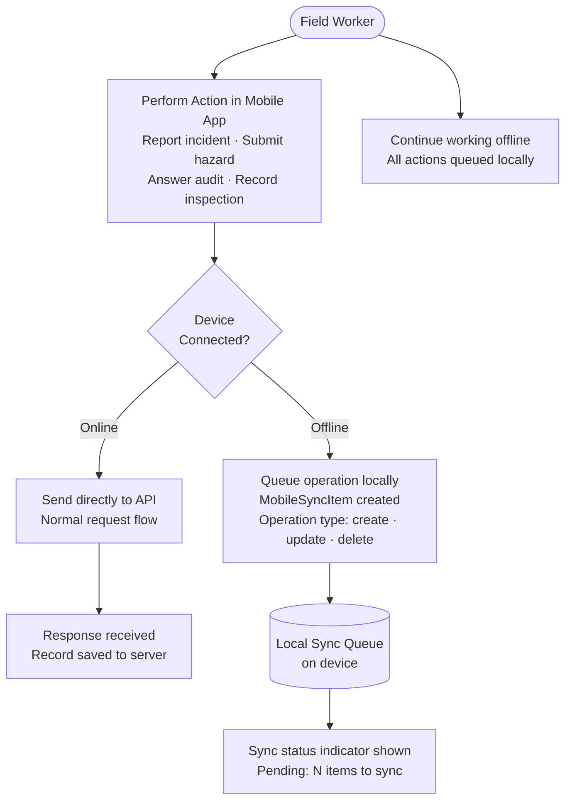
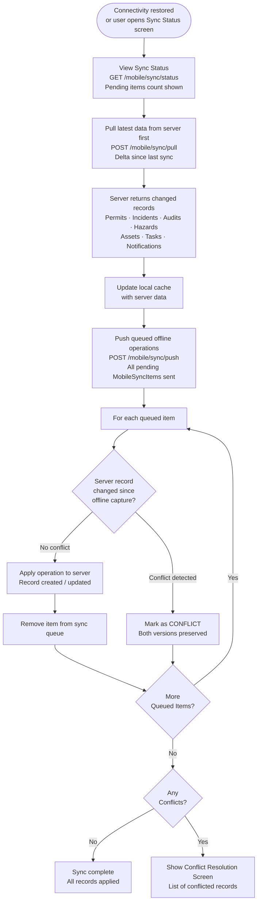
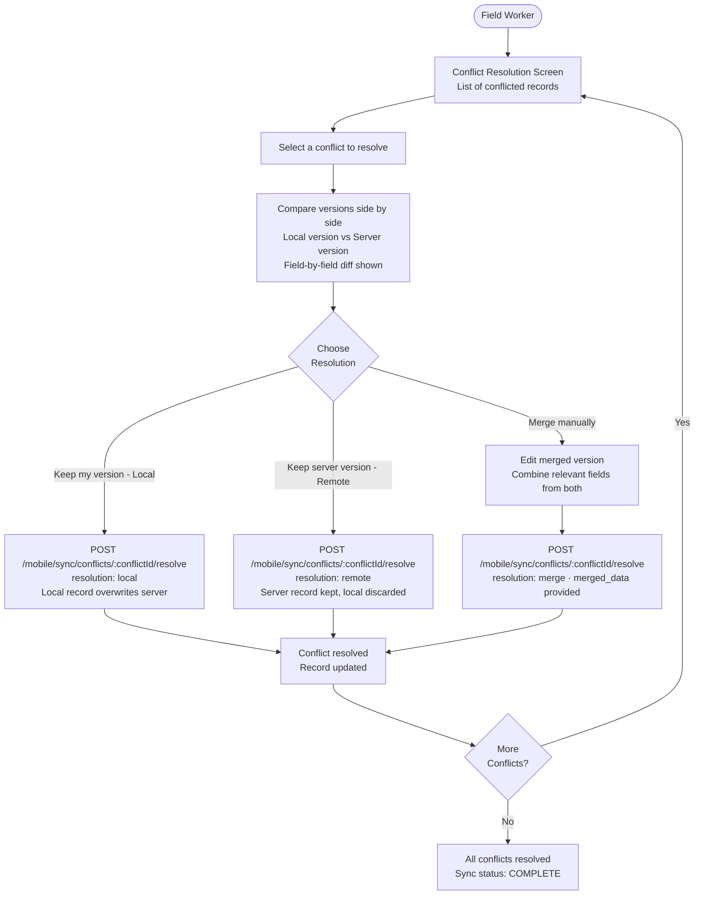
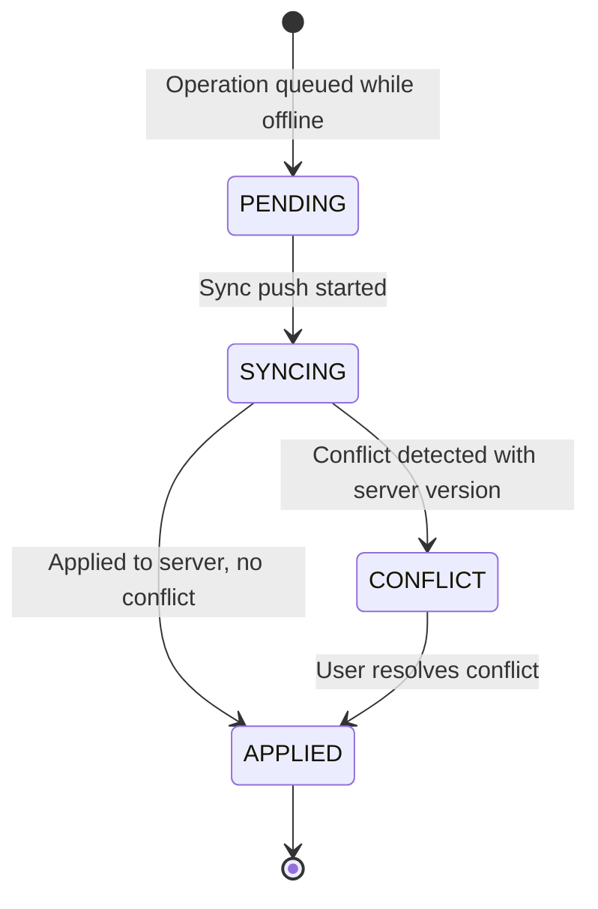
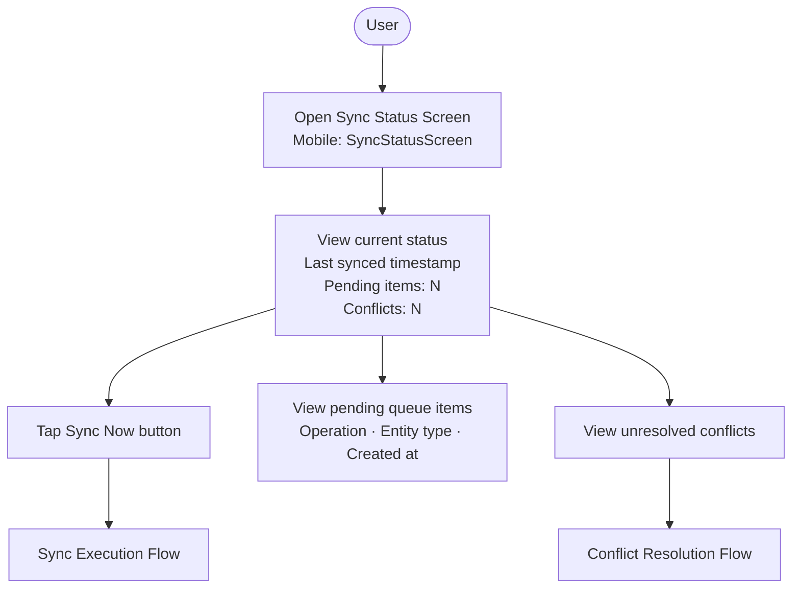

# Mobile Offline Sync Flow

## Offline Data Capture Flow

---

## Sync Execution Flow (When Connectivity Restored)

---

## Conflict Resolution Flow

---

## Sync Queue Item States

---

## Sync Status Screen

