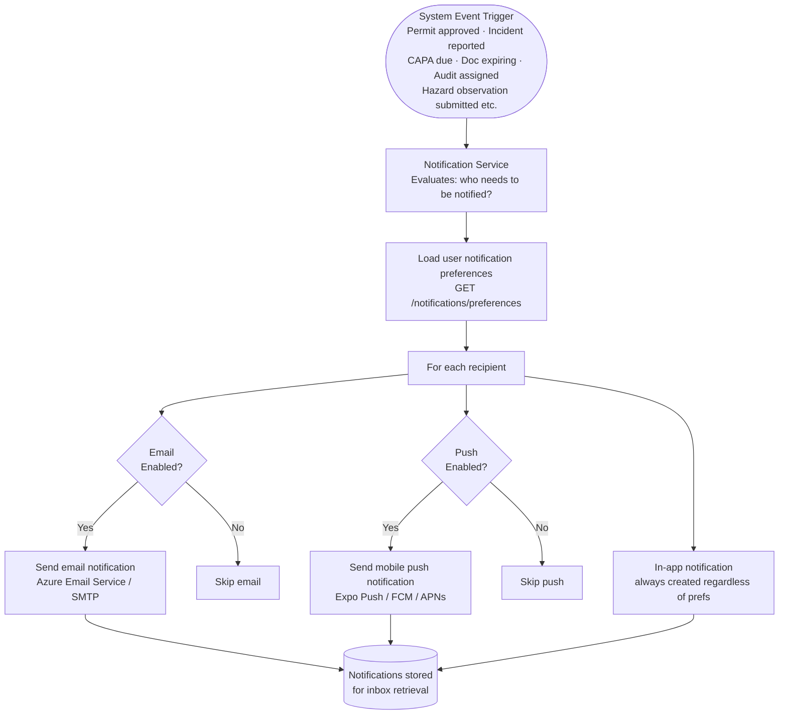
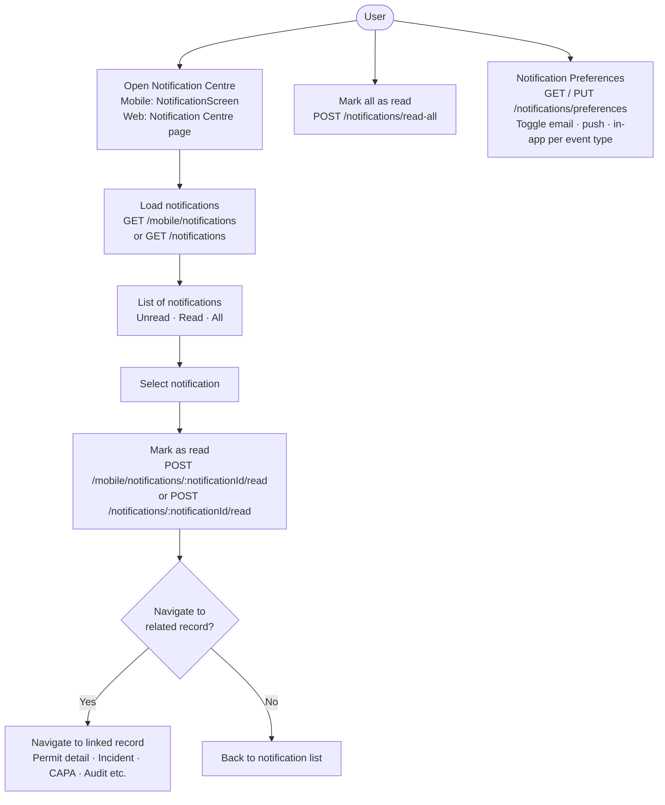
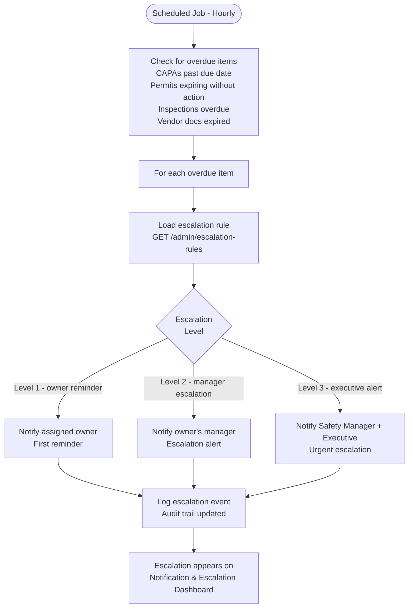
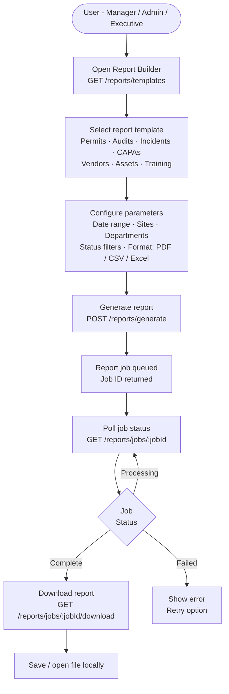
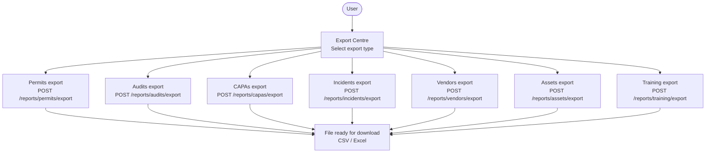

# Notification & Reporting Flow

## Notification Delivery Flow

---

## Notification Centre Flow (User)

---

## Escalation Flow (Overdue Actions)

---

## Report Generation Flow

---

## Quick Export Flows

---

## Notification Preference Categories

| Event Type | Default: Email | Default: Push | Default: In-App |
|---|---|---|---|
| Permit approval / rejection | Yes | Yes | Yes |
| Permit expiring soon | Yes | Yes | Yes |
| CAPA assigned | Yes | Yes | Yes |
| CAPA overdue | Yes | Yes | Yes |
| Incident reported (manager) | Yes | Yes | Yes |
| Audit assigned | Yes | Yes | Yes |
| Training gap identified | Yes | No | Yes |
| Certification expiring | Yes | No | Yes |
| Vendor document expiring | Yes | No | Yes |
| Escalation alert | Yes | Yes | Yes |
| Report ready | No | No | Yes |
| Sync conflict detected | No | Yes | Yes |
