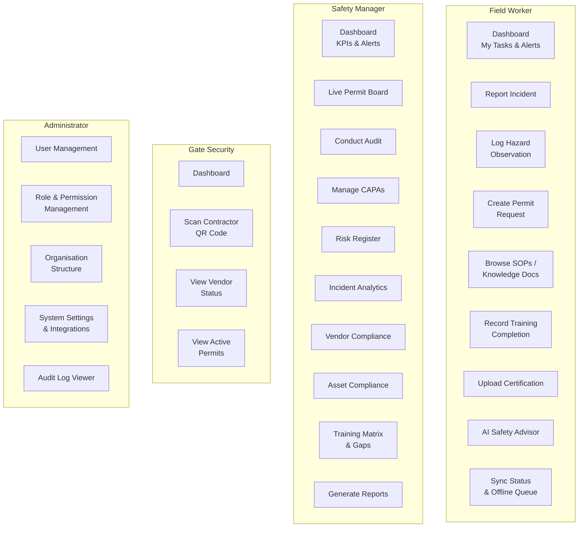
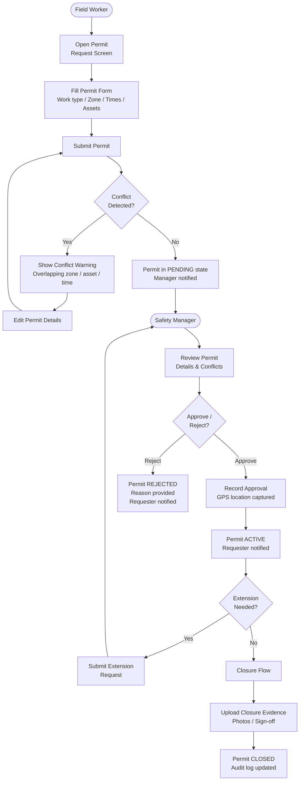
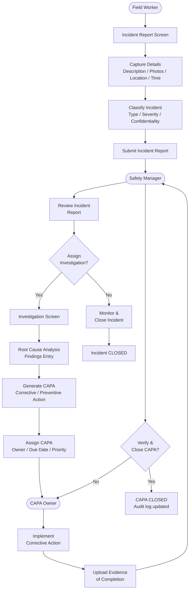
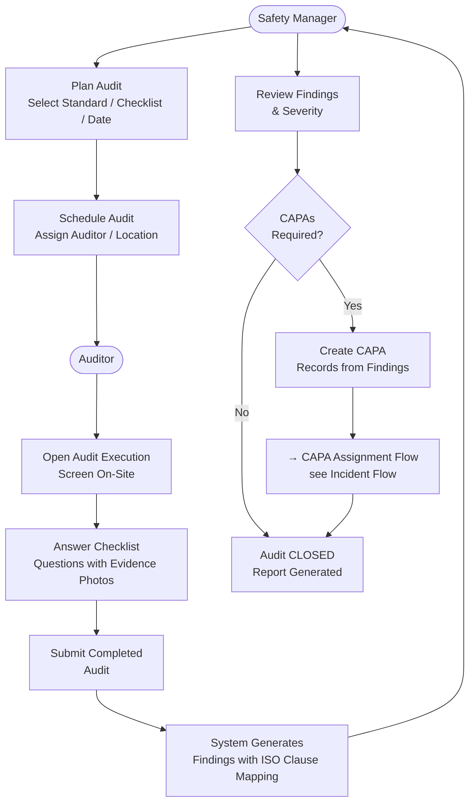
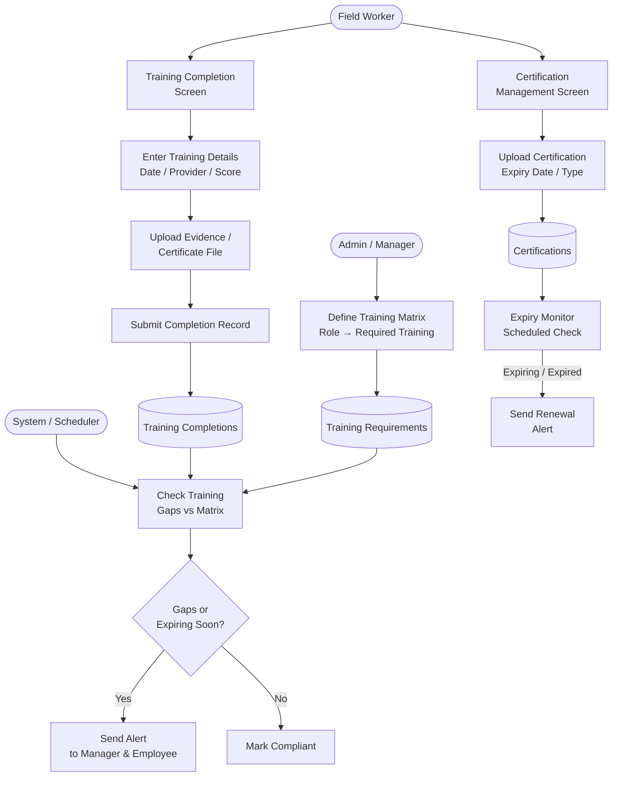
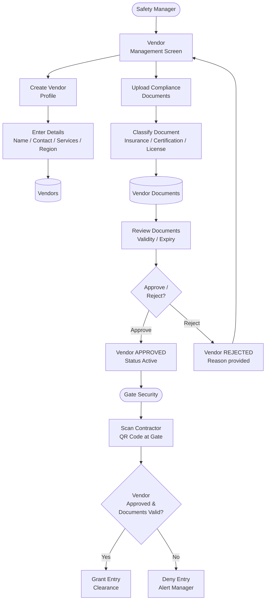
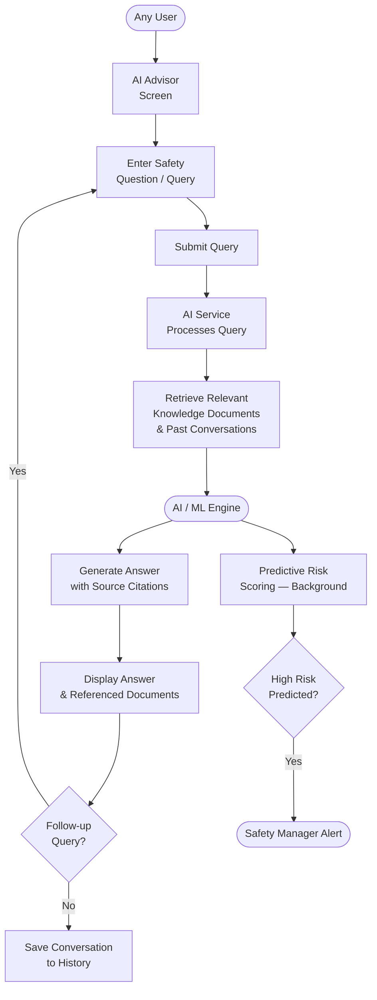
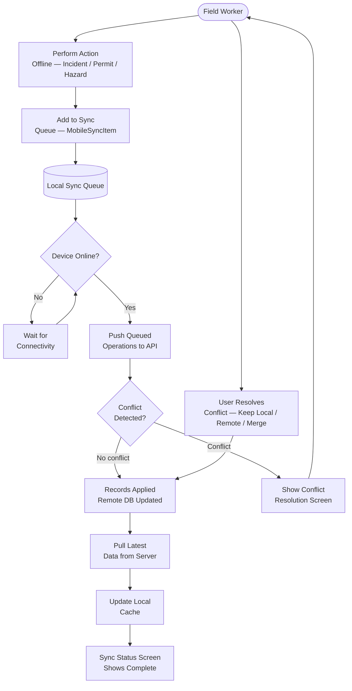
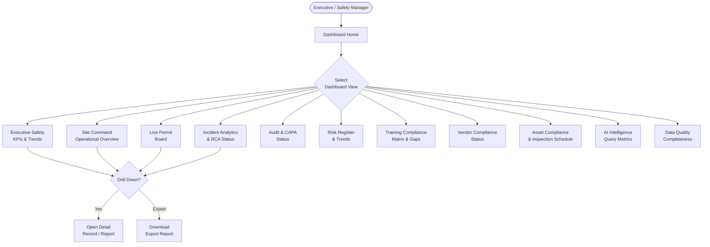

# User Flow Diagram — Health Smart Engage

## 1. Authentication & Onboarding Flow

---

## 2. Role-Based Navigation Overview

---

## 3. Work Permit Flow

---

## 4. Incident Reporting & Investigation Flow

---

## 5. Audit & Compliance Flow

---

## 6. Training & Certification Flow

---

## 7. Vendor Management Flow

---

## 8. AI Safety Advisor Flow

---

## 9. Mobile Offline Sync Flow

---

## 10. Executive Dashboard Flow

---

## Summary: User Journey Map

| User Role | Entry Point | Core Tasks | Exit / Output |
|---|---|---|---|
| Field Worker | Login → Dashboard | Report incident, Log hazard, Create permit, Browse SOPs, Record training | Submitted records, Accessed SOPs |
| Safety Manager | Login → Dashboard | Review permits, Conduct audits, Manage CAPAs, View dashboards, Generate reports | Approved permits, Closed CAPAs, Reports |
| Gate Security | Login → Dashboard | Scan contractor QR, Verify vendor status, View active permits | Entry clearance granted / denied |
| Administrator | Login → Admin Panel | Manage users/roles, Configure org structure, View audit logs, Manage integrations | System configured, Users provisioned |
| Executive | Login → Dashboard | View KPI dashboards, Drill into incidents/risk/compliance | Insight reports, Data exports |
