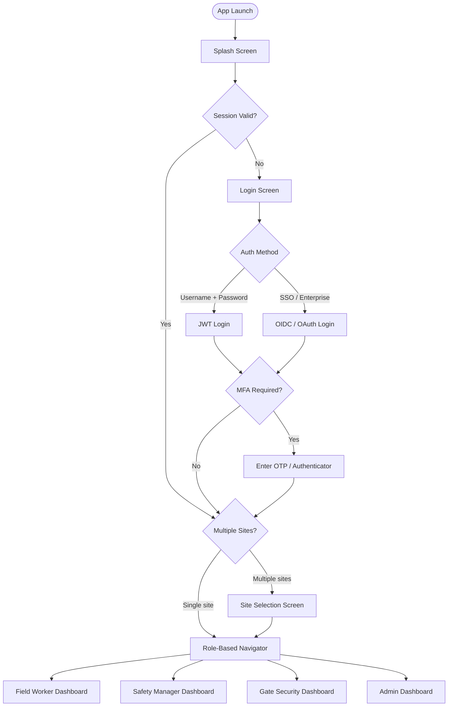
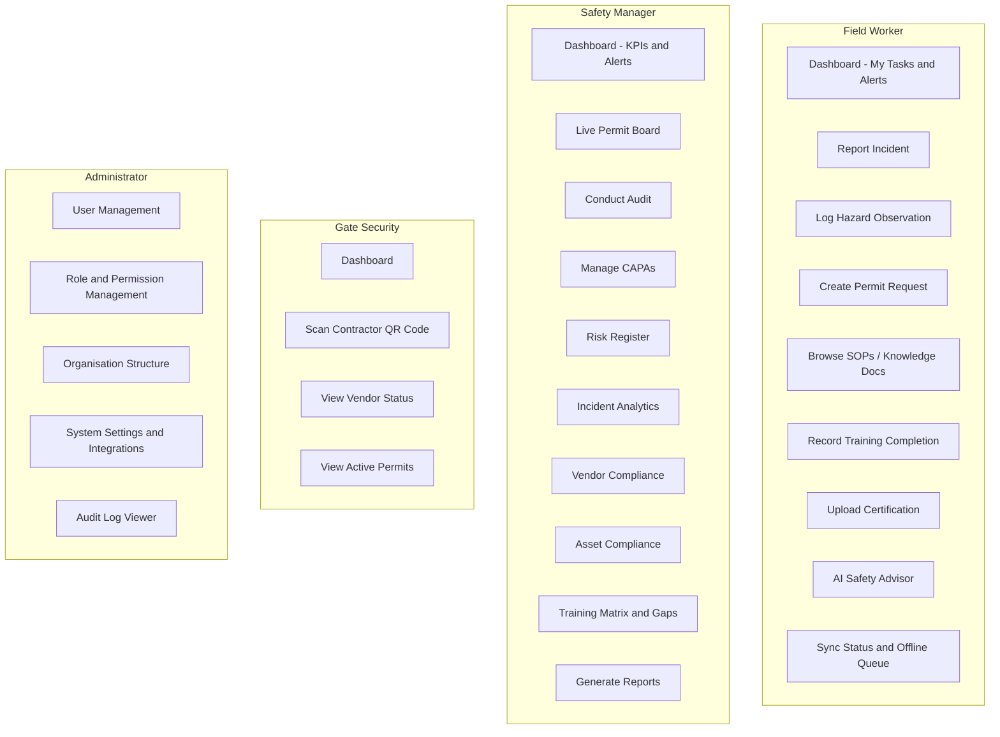
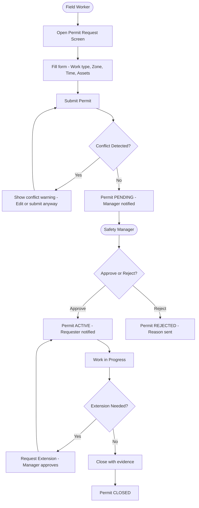
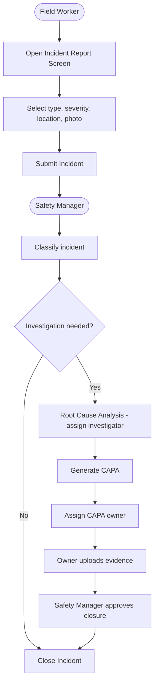
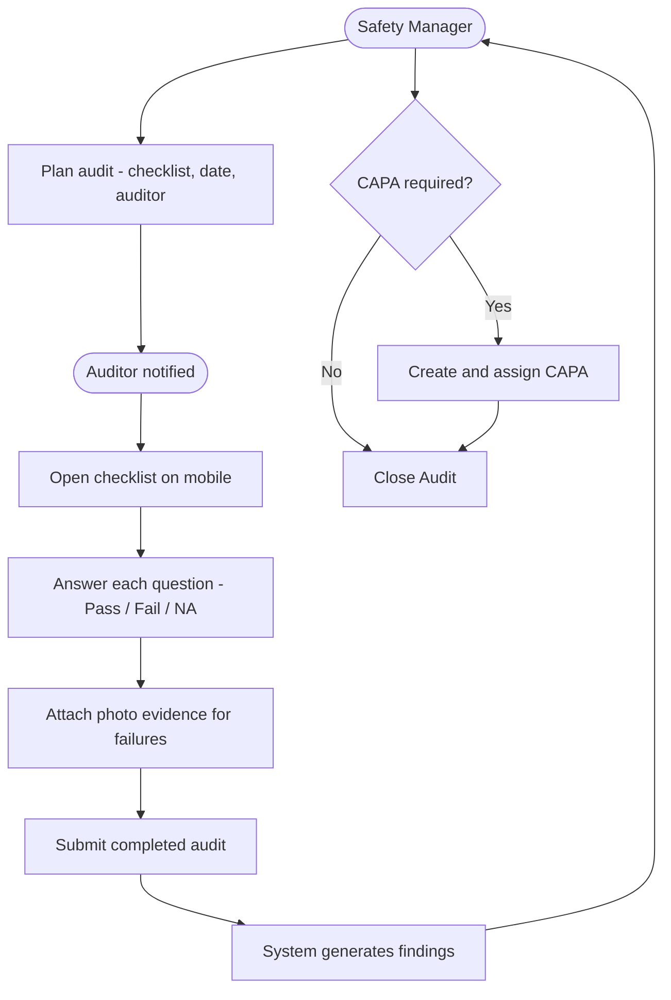
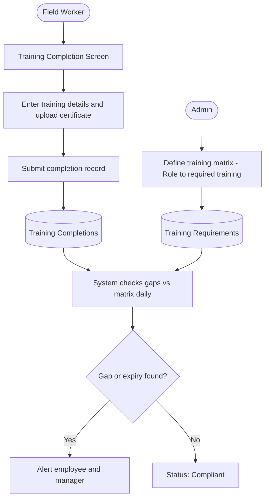
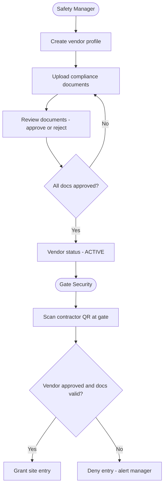
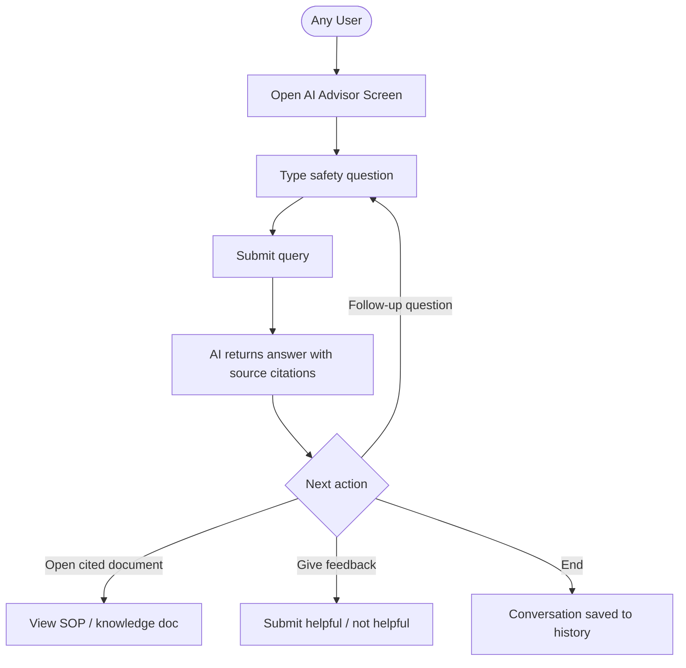
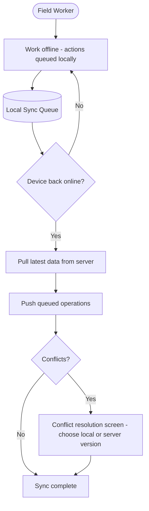
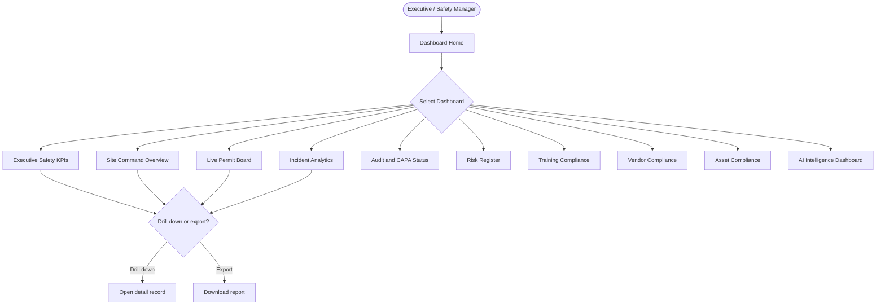

# User Flow Diagram - Health Smart Engage

## 1. Authentication and Onboarding Flow

---

## 2. Role-Based Navigation Overview

---

## 3. Work Permit User Flow

---

## 4. Incident Reporting User Flow

---

## 5. Audit Execution User Flow

---

## 6. Training and Certification User Flow

---

## 7. Vendor and Contractor User Flow

---

## 8. AI Safety Advisor User Flow

---

## 9. Mobile Offline Sync User Flow

---

## 10. Executive Dashboard User Flow

---

## Summary: User Journey Map

| User Role | Entry Point | Core Tasks | Output |
|---|---|---|---|
| Field Worker | Login - Dashboard | Report incident, log hazard, create permit, browse SOPs, record training | Submitted records, accessed SOPs |
| Safety Manager | Login - Dashboard | Review permits, conduct audits, manage CAPAs, view dashboards, generate reports | Approved permits, closed CAPAs, reports |
| Gate Security | Login - Dashboard | Scan contractor QR, verify vendor status, view active permits | Entry clearance granted or denied |
| Administrator | Login - Admin Panel | Manage users and roles, configure org structure, view audit logs | System configured, users provisioned |
| Executive | Login - Dashboard | View KPI dashboards, drill into incidents, risk, compliance | Insight reports, data exports |
