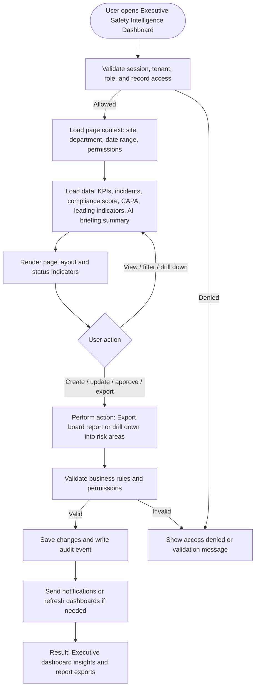

# Executive Safety Intelligence Dashboard

| Field | Detail |
|---|---|
| Page Type | Dashboard |
| Module | Executive |
| Primary Roles | Executive Sponsor, Plant Manager, Safety Manager |
| Purpose | Show board-level safety intelligence. |

## What This Page Shows

| Area | Content |
|---|---|
| Header | Page title, site/tenant context, date range where applicable, role-aware actions |
| Filters | Status, site, department, owner, date range, severity, category, or module-specific filters |
| Main Content | KPIs, incidents, compliance score, CAPA, leading indicators, AI briefing summary |
| Primary Action | Export board report or drill down into risk areas |
| Output | Executive dashboard insights and report exports |
| Audit Behavior | View, create, update, approve, reject, export, and confidential access actions are audit logged where applicable |

## Page Flowchart

