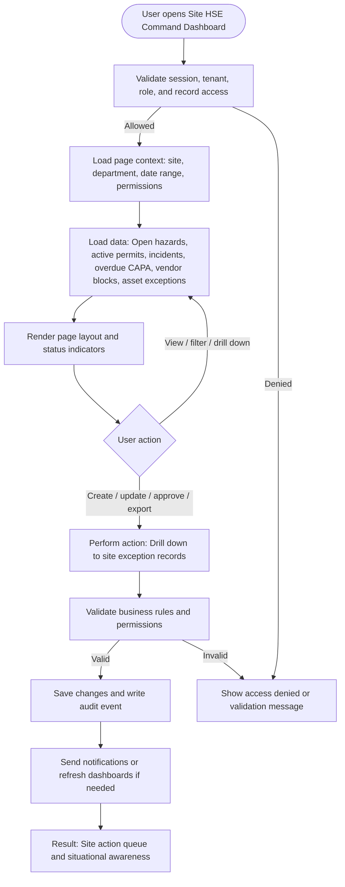

# Site HSE Command Dashboard

| Field | Detail |
|---|---|
| Page Type | Dashboard |
| Module | Operations |
| Primary Roles | Plant Manager, Safety Manager |
| Purpose | Show site-level operational safety status. |

## What This Page Shows

| Area | Content |
|---|---|
| Header | Page title, site/tenant context, date range where applicable, role-aware actions |
| Filters | Status, site, department, owner, date range, severity, category, or module-specific filters |
| Main Content | Open hazards, active permits, incidents, overdue CAPA, vendor blocks, asset exceptions |
| Primary Action | Drill down to site exception records |
| Output | Site action queue and situational awareness |
| Audit Behavior | View, create, update, approve, reject, export, and confidential access actions are audit logged where applicable |

## Page Flowchart

