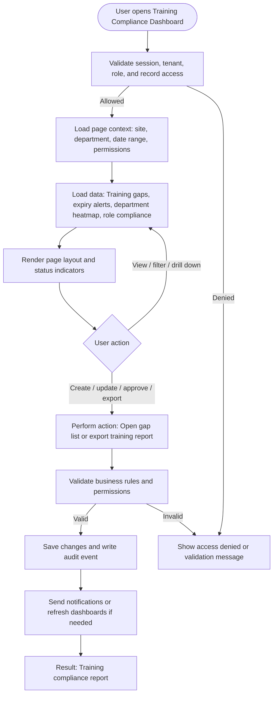

# Training Compliance Dashboard

| Field | Detail |
|---|---|
| Page Type | Dashboard |
| Module | People and Training |
| Primary Roles | HR Admin, Training Coordinator, Safety Manager |
| Purpose | Show workforce training compliance. |

## What This Page Shows

| Area | Content |
|---|---|
| Header | Page title, site/tenant context, date range where applicable, role-aware actions |
| Filters | Status, site, department, owner, date range, severity, category, or module-specific filters |
| Main Content | Training gaps, expiry alerts, department heatmap, role compliance |
| Primary Action | Open gap list or export training report |
| Output | Training compliance report |
| Audit Behavior | View, create, update, approve, reject, export, and confidential access actions are audit logged where applicable |

## Page Flowchart

