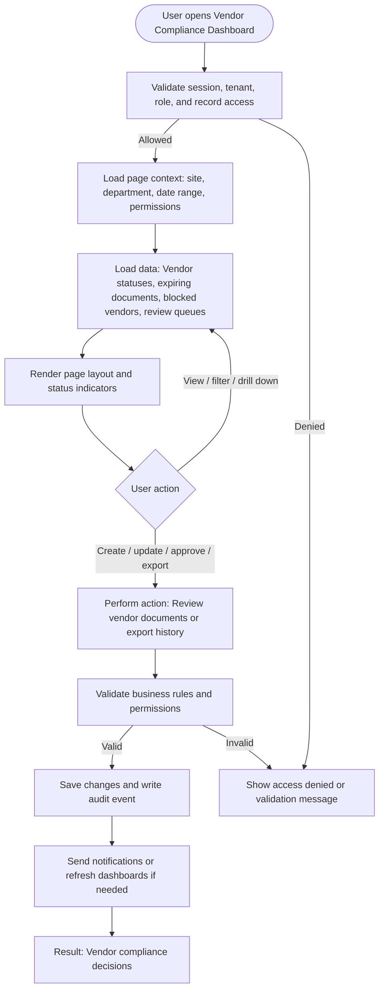

# Vendor Compliance Dashboard

| Field | Detail |
|---|---|
| Page Type | Dashboard |
| Module | Vendor Compliance |
| Primary Roles | Procurement Manager, Compliance Manager, Gate Security |
| Purpose | Show vendor readiness. |

## What This Page Shows

| Area | Content |
|---|---|
| Header | Page title, site/tenant context, date range where applicable, role-aware actions |
| Filters | Status, site, department, owner, date range, severity, category, or module-specific filters |
| Main Content | Vendor statuses, expiring documents, blocked vendors, review queues |
| Primary Action | Review vendor documents or export history |
| Output | Vendor compliance decisions |
| Audit Behavior | View, create, update, approve, reject, export, and confidential access actions are audit logged where applicable |

## Page Flowchart

