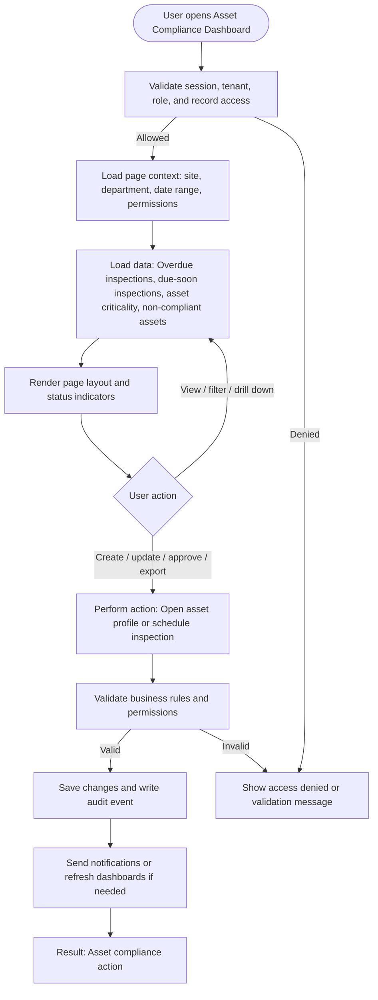

# Asset Compliance Dashboard

| Field | Detail |
|---|---|
| Page Type | Dashboard |
| Module | Asset Compliance |
| Primary Roles | Maintenance Manager, Safety Manager |
| Purpose | Show equipment readiness. |

## What This Page Shows

| Area | Content |
|---|---|
| Header | Page title, site/tenant context, date range where applicable, role-aware actions |
| Filters | Status, site, department, owner, date range, severity, category, or module-specific filters |
| Main Content | Overdue inspections, due-soon inspections, asset criticality, non-compliant assets |
| Primary Action | Open asset profile or schedule inspection |
| Output | Asset compliance action |
| Audit Behavior | View, create, update, approve, reject, export, and confidential access actions are audit logged where applicable |

## Page Flowchart

