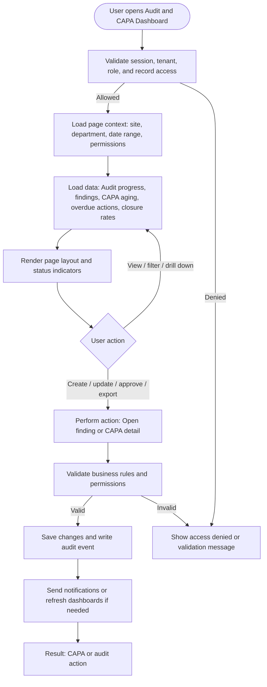

# Audit and CAPA Dashboard

| Field | Detail |
|---|---|
| Page Type | Dashboard |
| Module | Compliance and CAPA |
| Primary Roles | Compliance Manager, Safety Auditor, Safety Manager |
| Purpose | Show audit and corrective action health. |

## What This Page Shows

| Area | Content |
|---|---|
| Header | Page title, site/tenant context, date range where applicable, role-aware actions |
| Filters | Status, site, department, owner, date range, severity, category, or module-specific filters |
| Main Content | Audit progress, findings, CAPA aging, overdue actions, closure rates |
| Primary Action | Open finding or CAPA detail |
| Output | CAPA or audit action |
| Audit Behavior | View, create, update, approve, reject, export, and confidential access actions are audit logged where applicable |

## Page Flowchart

