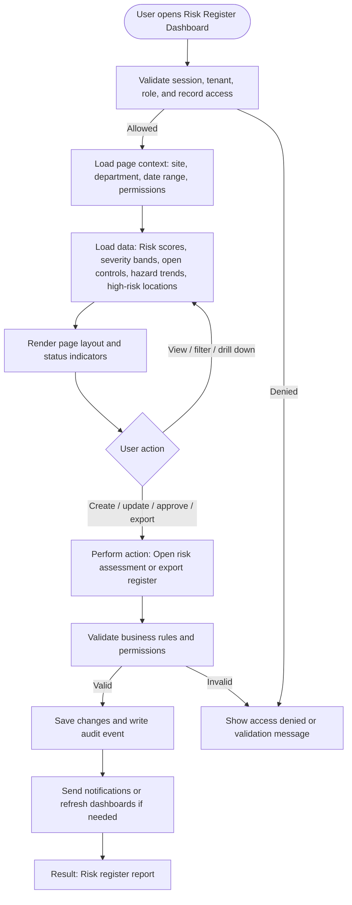

# Risk Register Dashboard

| Field | Detail |
|---|---|
| Page Type | Dashboard |
| Module | Risk and Hazard |
| Primary Roles | Risk Manager, Safety Manager, Plant Manager |
| Purpose | Show risk trends. |

## What This Page Shows

| Area | Content |
|---|---|
| Header | Page title, site/tenant context, date range where applicable, role-aware actions |
| Filters | Status, site, department, owner, date range, severity, category, or module-specific filters |
| Main Content | Risk scores, severity bands, open controls, hazard trends, high-risk locations |
| Primary Action | Open risk assessment or export register |
| Output | Risk register report |
| Audit Behavior | View, create, update, approve, reject, export, and confidential access actions are audit logged where applicable |

## Page Flowchart

