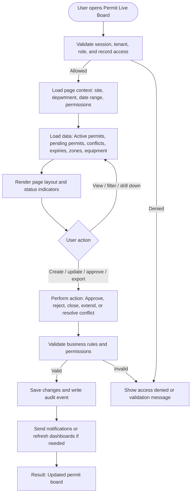

# Permit Live Board

| Field | Detail |
|---|---|
| Page Type | Dashboard |
| Module | Permit to Work |
| Primary Roles | Permit Coordinator, Safety Manager, Plant Manager |
| Purpose | Show live work status. |

## What This Page Shows

| Area | Content |
|---|---|
| Header | Page title, site/tenant context, date range where applicable, role-aware actions |
| Filters | Status, site, department, owner, date range, severity, category, or module-specific filters |
| Main Content | Active permits, pending permits, conflicts, expiries, zones, equipment |
| Primary Action | Approve, reject, close, extend, or resolve conflict |
| Output | Updated permit board |
| Audit Behavior | View, create, update, approve, reject, export, and confidential access actions are audit logged where applicable |

## Page Flowchart

