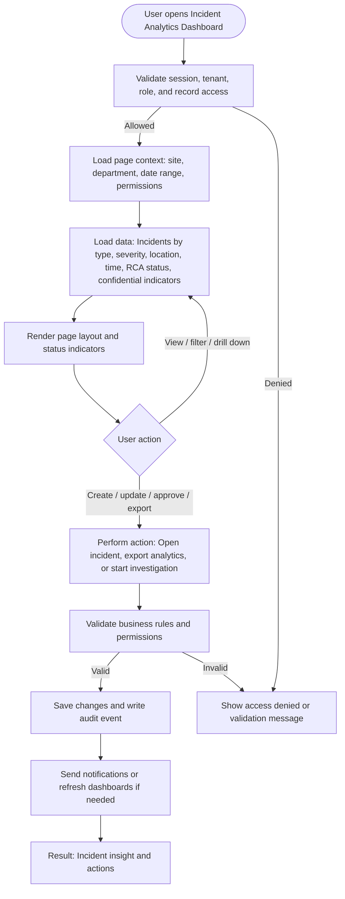

# Incident Analytics Dashboard

| Field | Detail |
|---|---|
| Page Type | Dashboard |
| Module | Incident Management |
| Primary Roles | Safety Manager, Legal/HR Officer, Plant Manager |
| Purpose | Show incident trends and hotspots. |

## What This Page Shows

| Area | Content |
|---|---|
| Header | Page title, site/tenant context, date range where applicable, role-aware actions |
| Filters | Status, site, department, owner, date range, severity, category, or module-specific filters |
| Main Content | Incidents by type, severity, location, time, RCA status, confidential indicators |
| Primary Action | Open incident, export analytics, or start investigation |
| Output | Incident insight and actions |
| Audit Behavior | View, create, update, approve, reject, export, and confidential access actions are audit logged where applicable |

## Page Flowchart

