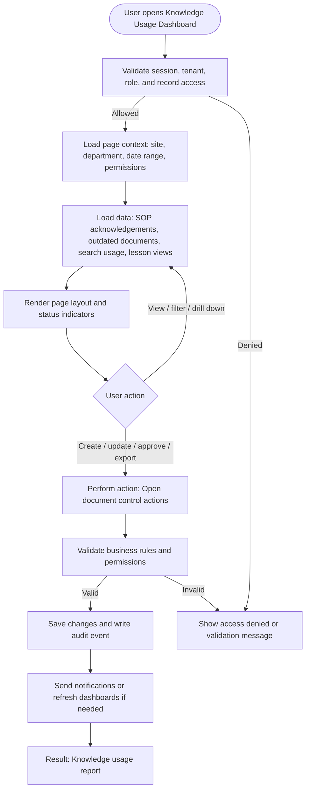

# Knowledge Usage Dashboard

| Field | Detail |
|---|---|
| Page Type | Dashboard |
| Module | Knowledge Centre |
| Primary Roles | Document Controller, Safety Manager |
| Purpose | Show SOP and document usage. |

## What This Page Shows

| Area | Content |
|---|---|
| Header | Page title, site/tenant context, date range where applicable, role-aware actions |
| Filters | Status, site, department, owner, date range, severity, category, or module-specific filters |
| Main Content | SOP acknowledgements, outdated documents, search usage, lesson views |
| Primary Action | Open document control actions |
| Output | Knowledge usage report |
| Audit Behavior | View, create, update, approve, reject, export, and confidential access actions are audit logged where applicable |

## Page Flowchart

