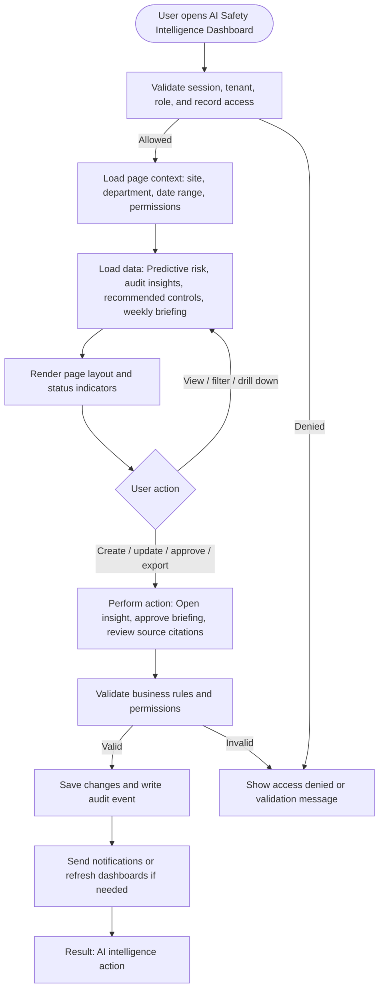

# AI Safety Intelligence Dashboard

| Field | Detail |
|---|---|
| Page Type | Dashboard |
| Module | AI Intelligence |
| Primary Roles | Executive Sponsor, Safety Manager |
| Purpose | Show AI-generated insights. |

## What This Page Shows

| Area | Content |
|---|---|
| Header | Page title, site/tenant context, date range where applicable, role-aware actions |
| Filters | Status, site, department, owner, date range, severity, category, or module-specific filters |
| Main Content | Predictive risk, audit insights, recommended controls, weekly briefing |
| Primary Action | Open insight, approve briefing, review source citations |
| Output | AI intelligence action |
| Audit Behavior | View, create, update, approve, reject, export, and confidential access actions are audit logged where applicable |

## Page Flowchart

